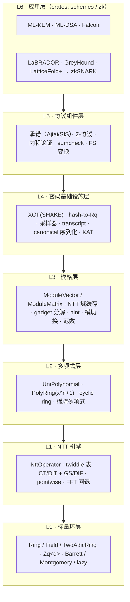
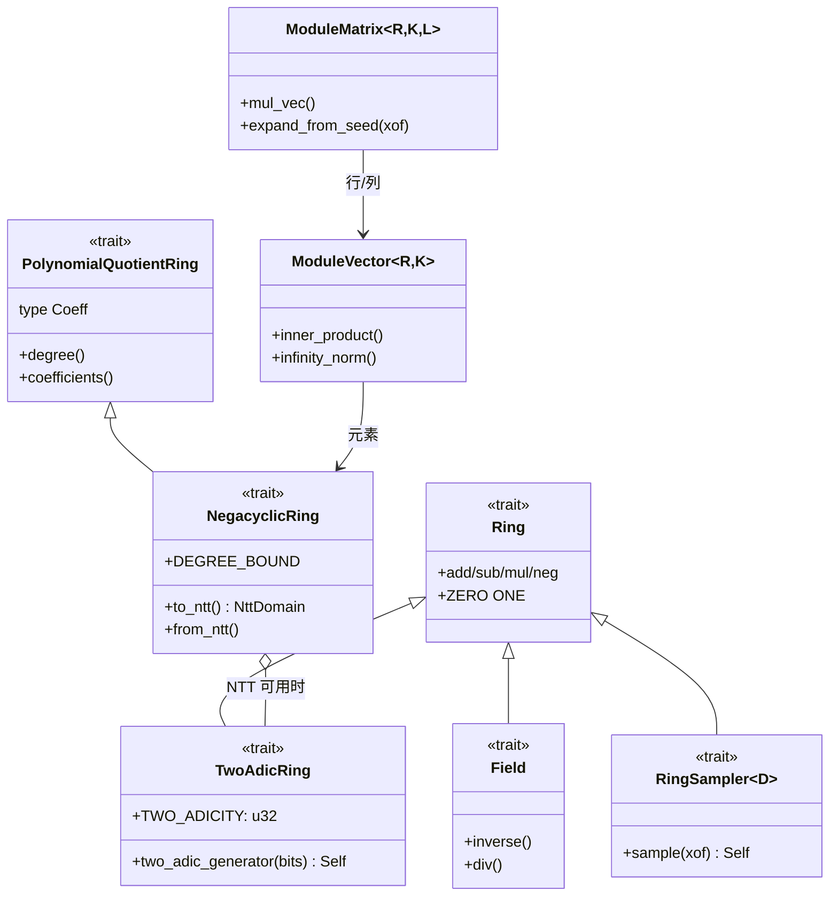
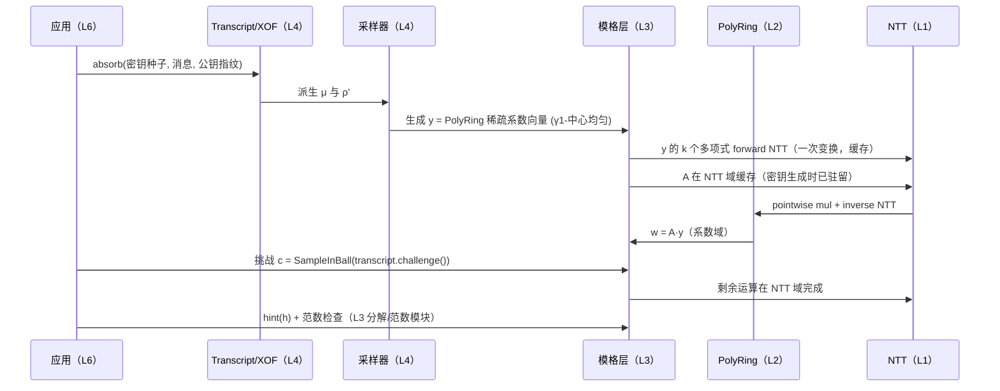
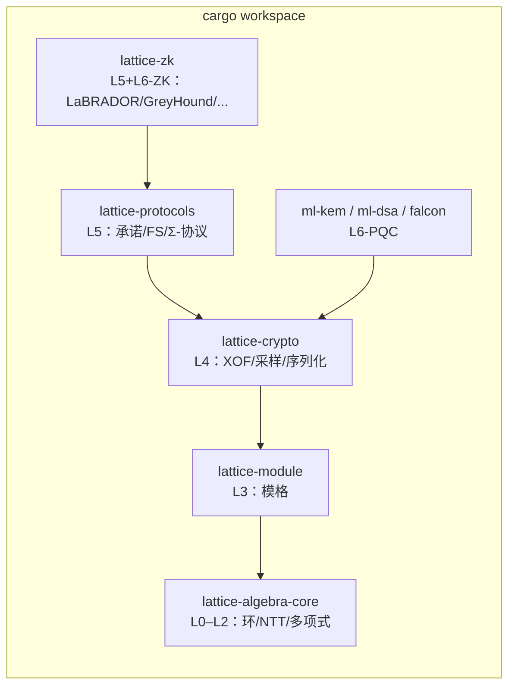

# 分层架构总览

## 设计哲学

对标 arkworks（trait 驱动的代数抽象）与 plonky3（面向性能的 field/NTT 抽象），本库遵循四条原则：

1. **能力 trait 组合，而非上帝 trait**：类型通过实现一组小而正交的能力 trait（可逆、NTT 友好、可采样……）参与上层泛型算法；上层算法只声明它需要的最小能力。
2. **参数即类型**：`q`、`n`、模块维度 `k/l`、采样参数用 const 泛型与零大小标记类型（ZST）表达，零运行时开销；方案参数集（如 ML-DSA-65）是一个实现参数 trait 的 ZST。
3. **确定性优先于随机性**：密码学组件的接口吃**种子 + 域分隔标签**（XOF 驱动），而不是裸 `Rng`。随机性只在最外层注入。这与 FIPS 203/204 的确定性派生结构一致，也让 KAT 与模糊测试可行。
4. **表示自由**：同一环元素可在系数域与 NTT 域之间切换；上层协议可显式控制表示（性能关键），但默认路径自动分派。

## 七层架构

**层间规则**：只允许向下依赖；同层不互相依赖（L4 各子模块独立）；L5/L6 之间允许反向回调（协议把约束投给算术层）。每一层的公开 trait 是稳定的"钩子"，实现细节可以整体替换。

## 能力 trait 体系

要点：

- `PolyRing<R, N>` 只有当 `R: TwoAdicRing` 且 `N ≤ 2^TWO_ADICITY` 时才获得 NTT 乘法路径，否则自动回退——这一分派逻辑现在已存在，将被收进 `NegacyclicRing` 的 blanket impl。
- `RingSampler<D>` 以分布 `D` 为类型参数（Uniform / CBD / Gauss / Challenge），使"同一类型、不同分布"可泛型化，方案层通过参数集选定分布。

## 数据流：一次 ML-DSA 签名如何穿越各层

## Crate 拆分路线

单 crate（现状）→ 在 L4 成型后拆为 cargo workspace：

拆分时机与目录迁移见[路线图](/roadmap)。在单 crate 阶段，用模块前缀（`module::`、`crypto::`、`protocols::`）预留命名空间。

## 关键设计决策（ADR 摘要）

| # | 决策 | 选择 | 理由 | 放弃的替代方案 |
| --- | --- | --- | --- | --- |
| ADR-1 | 环参数表达 | const 泛型 `Zq<q>`、`PolyRing<R, N>` | 零开销、编译期检查 NTT 可用性 | 运行时参数对象（现有遗留路径，将删除） |
| ADR-2 | NTT 分派 | trait 能力 + blanket impl 自动回退 | 一个泛型 API 同时覆盖 NTT 友好与非友好 q | 强制所有 q NTT 友好（会把 Falcon 浮点路径排除在外） |
| ADR-3 | 随机性 | XOF 驱动、种子进接口 | 对齐 FIPS 规范、可复现测试 | 到处传 `&mut Rng` |
| ADR-4 | 序列化 | 自研 canonical trait + serde 并存 | 线上格式需位级压缩与跨语言一致 | 只用 serde（JSON 用于调试，不是线上格式） |
| ADR-5 | 常时时间 | 按层声明策略：L0–L3 默认 CT 友好实现，采样/Gaussian 单独声明 | CT 不是全有全无；浮点 Gaussian 本质非 CT，靠掩码+文档声明 | 全库强制 CT（会把 Falcon 排除在外） |
| ADR-6 | 方案参数集 | ZST + 参数 trait（`trait MlDsaParams`） | 编译期固化、可枚举多参数集、类型即文档 | 运行时参数结构体（性能与类型安全都差） |
| ADR-7 | 错误处理 | 运算层 panic-free 返回 `Result`；密码失败路径（拒绝/重采样）返回枚举 | 签名循环的拒绝采样需要类型化的重试信号 | panic / assert |

## 与手写实现的对照

以 ML-DSA 为例说明统一基座的收益：

| 手写实现（过去） | 基座驱动（目标） |
| --- | --- |
| 每个方案自带 NTT（常带 off-by-one bug） | `PolyRing` 一处实现，环公理 property test 全局复用 |
| 矩阵 A 扩展逻辑内联在方案里 | `ModuleMatrix::expand_from_seed` 泛型实现，Kyber/Dilithium 只是不同拒绝采样参数 |
| 范数检查散落各处 | L3 范数模块统一 `infinity_norm` / bound check，SNARK 与 PQC 共享 |
| 换参数 = 改一堆 magic number | 换参数集 = 换一个 ZST 类型 |
| KAT 无法交叉复用 | KAT 框架按层测试：先验环行为，再验方案向量 |
