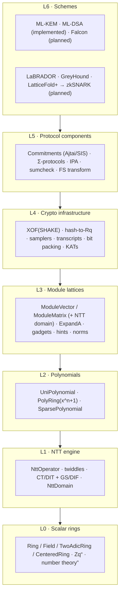
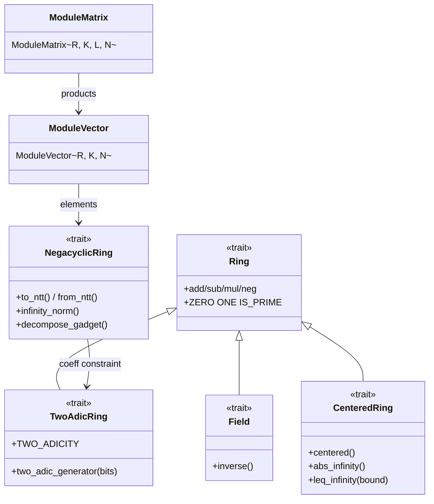
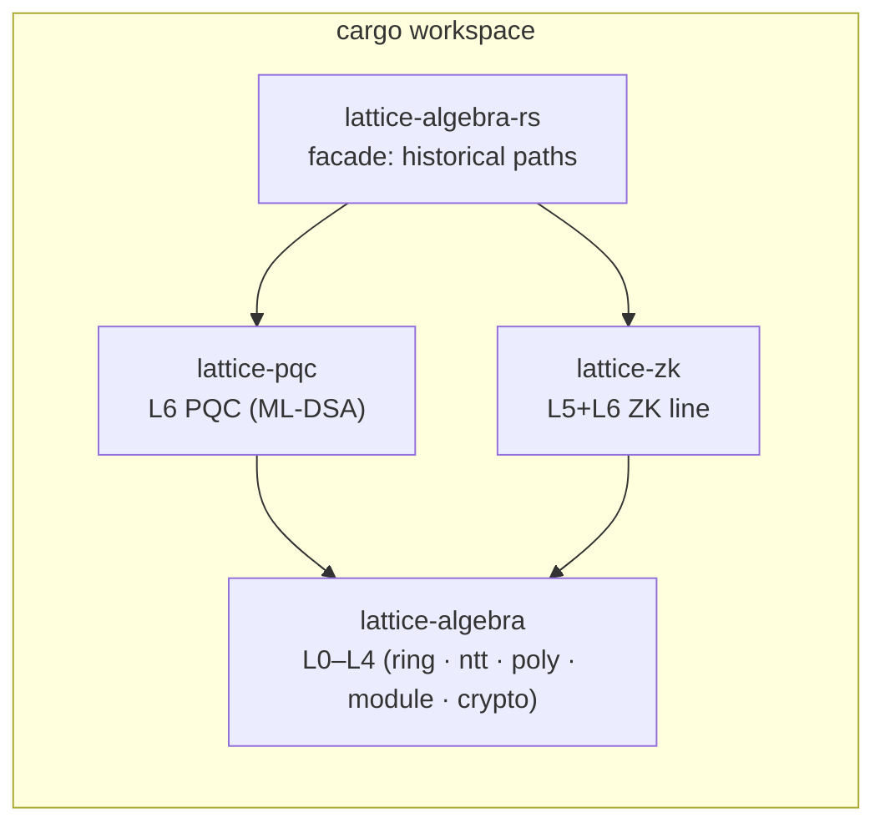

# Architecture

## Design philosophy

Mirroring arkworks (trait-driven algebra) and plonky3 (performance-oriented field/NTT abstractions), the library follows four principles:

1. **Capability traits, not god traits.** Types participate in generic algorithms by implementing small orthogonal capabilities (invertible, NTT-friendly, sampleable…); algorithms declare the minimum they need.
2. **Parameters are types.** `q`, `n`, module dimensions and sampling parameters are const generics and zero-sized marker types; a scheme parameter set (e.g. ML-DSA-65) is a ZST.
3. **Determinism over randomness.** Scheme-facing APIs take seeds and domain labels (XOF-driven), not bare RNGs; randomness is injected once at the top. This matches FIPS 203/204 and makes KATs and fuzzing possible.
4. **Representation freedom.** Ring elements can live in the coefficient or NTT domain; protocols control representations explicitly where it matters, while default paths dispatch automatically.

## The seven layers



**Layer rule:** dependencies point downward only; sibling layers do not depend on each other. Each layer's public traits are the stable hooks; implementations can be replaced wholesale.

## Capability trait system



`PolyRing<R, N>` gets the NTT path only when `R: TwoAdicRing` and the dimension fits `TWO_ADICITY`; otherwise it falls back automatically. `NttDomain<R, N>` is the typed NTT-domain representation (M1).

## Data flow: one ML-DSA signature through the layers

```mermaid
sequenceDiagram
    participant App as Scheme (L6)
    participant FS as Transcript/XOF (L4)
    participant S as Samplers (L4)
    participant M as Module layer (L3)
    participant P as PolyRing (L2)
    participant N as NTT (L1)

    App->>FS: absorb(key seed, message, pk binding)
    FS->>S: derive μ and mask seed ρ″
    S->>M: ExpandMask: y with coefficients in [−γ1+1, γ1]
    M->>N: NTT(y) — one transform per polynomial, cached
    M->>N: Â resident in the NTT domain since keygen
    N->>P: pointwise mul + inverse NTT
    P->>M: w = A·y; w1 = HighBits(w)
    App->>M: c = SampleInBall(c̃) → sparse × s1
    M->>M: z = y + c·s1; norm gates; h = MakeHint(...)
    App->>App: sigEncode(c̃, z, h)
```

## Crate split (as shipped in W1)



## Key decisions (ADR summary)

| # | Decision | Choice | Rationale | Rejected alternative |
| --- | --- | --- | --- | --- |
| ADR-1 | Ring parameters | const generics `Zq<q>`, `PolyRing<R, N>` | zero overhead, compile-time NTT checks | runtime parameter objects (legacy path — deleted) |
| ADR-2 | NTT dispatch | capability trait + blanket fallback | one generic API covers 2-adic and non-2-adic moduli | requiring all q to be NTT-friendly |
| ADR-3 | Randomness | XOF-driven, seeds in APIs | aligns with FIPS structure, reproducible tests | `&mut Rng` everywhere |
| ADR-4 | Serialization | custom canonical trait + serde side by side | wire formats need bit packing; serde JSON is debug-only | serde-only |
| ADR-5 | Constant time | declared per layer; sampling/Gaussian documented separately | CT is not all-or-nothing; float Gaussian is inherently non-CT | strict whole-crate CT |
| ADR-6 | Scheme parameter sets | ZST + parameter trait | compile-time fixed, self-documenting types | runtime parameter structs |
| ADR-7 | Error handling | panic-free `Result` in codec paths; typed rejection signals in signing loops | rejection sampling needs typed retry signals | panics on secret-dependent paths |
