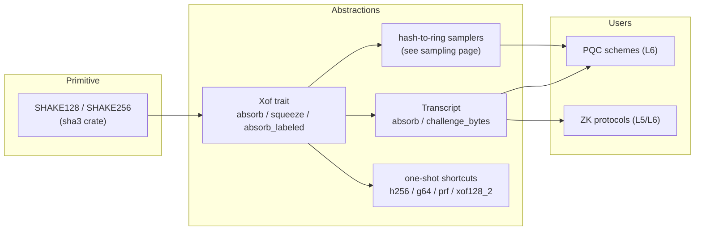

# L4 · Hashing & Fiat–Shamir

Turning interactive protocols into signatures/proofs means deriving challenges from a hash of everything public so far. Domain-separation mistakes are the most common implementation vulnerability in this space, so the API shape enforces the discipline: absorb before challenge, length-prefix everything, labels come from parameter sets.

## Components



## `Xof` trait

```rust
pub trait Xof: Clone {
    fn new(domain: &[u8]) -> Self;
    fn absorb(&mut self, data: &[u8]);
    fn absorb_labeled(&mut self, label: &[u8], data: &[u8]); // length-prefixed
    fn squeeze(&mut self, out: &mut [u8]);
}
```

- Instances: `Shake128Xof` (168-byte blocks), `Shake256Xof` (136-byte blocks).
- **Length-encoded absorbing**: `absorb_labeled` prefixes label and data with their lengths, so `("ab", "c")` and `("a", "bc")` always diverge.
- **Stream semantics**: squeezing tracks an output offset over the absorbed state; absorbing after squeezing continues the same stream — matching the incremental absorb/squeeze patterns of the FIPS reference code.

## Transcript (Fiat–Shamir)

```rust
let mut tr = Transcript::<Shake256Xof>::new(b"ML-DSA-65 sign");
tr.absorb(b"pk", pk_bytes);
tr.absorb(b"commitment", commitment);
let challenge = tr.challenge_bytes(32); // state advances; two calls differ
```

- The API shape (absorb-then-challenge, forward-only state) makes the classic mistakes structurally hard: forgetting to bind the public key, or re-deriving the same challenge twice, are visible in review and caught by tests.
- Domain labels are owned by scheme parameter sets, not callers.
- ML-DSA's `μ` derivation (`tr ‖ M′`) sits on this layer; challenge *distributions* come from the sampling layer — the transcript only derives bytes.

## Testing

- determinism and domain separation;
- labeled-absorb injectivity on pairs (`("ab","c") ≠ ("a","bc")`);
- incremental squeeze equivalence (one 64-byte squeeze = two 32-byte squeezes);
- order sensitivity and challenge-state advancement.
