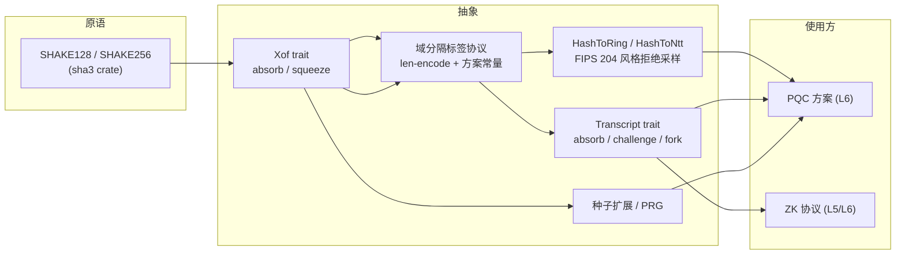

# L4 · 哈希与 Fiat–Shamir

几乎所有格方案的最后一步都是"把交互式协议变成非交互式"：哈希进 → 挑战出。这一层的质量直接决定方案安全性（FS 悖论、域分隔错误是历史上最常见的实现漏洞）。

## 组件



## Xof trait

```rust
pub trait Xof: Clone {
    /// 域分隔初始化：绑定方案 ID、参数集、算法角色
    fn new(domain: &[u8]) -> Self;
    fn absorb(&mut self, data: &[u8]);
    fn squeeze(&mut self, out: &mut [u8]);
}
```

- 实例：`Shake128`（r = 168 字节块）、`Shake256`（r = 136 字节块）。
- **长度编码内建**：`absorb` 对变长数据自动前缀长度（`u32 LE`），防拼接歧义（`("ab","c")` 与 `("a","bc")` 可区分）。
- `domain` 常量由**方案参数集**给出（如 `"ML-DSA-65 sign"`），协议层无权自造。

## HashToRing（FIPS 204 风格）

哈希输出 → `R_q` 元素（或 NTT 域直接采样），核心是拒绝采样窗口的选择：

```rust
pub trait HashToRing: NegacyclicRing {
    /// 全宽均匀：3 字节/系数，去高位，拒绝 ≥ q（ML-DSA c 的预处理）
    fn hash_to_uniform(xof: &mut impl Xof) -> Self;
    /// NTT 域高精度采样（ML-DSA ExpandA 的 a 系数）
    fn hash_to_ntt(xof: &mut impl Xof) -> NttDomain<Self>;
}
```

## Transcript（Fiat–Shamir 脚手架）

```rust
pub trait Transcript {
    type Challenge;
    /// 吸收公开值（承诺、公钥、消息……）
    fn absorb(&mut self, label: &'static str, data: &[u8]);
    /// 派生挑战（吸收后状态的单向函数输出）
    fn challenge(&mut self, label: &'static str) -> Self::Challenge;
}
```

- 默认实现 `XofTranscript`：维护单个 Xof，`absorb`/`challenge` 都是状态转移——**挑战后必须重新 absorb**（禁止连续两次 challenge 不吸中间值）；
- ZK 协议需求：挑战空间可配置（`Challenge = PolyRing` 稀疏 / 小环元素 / 标量），由协议参数决定，L4 只管派生不管分布——分布来自 L4 采样层；
- 多轮/并行重复（Lyubashevsky 型协议的重复 t 次）以 `transcript.fork(i)` 显式建模，保证第 i 次重复的挑战绑定重复索引。

## 域分隔协议（约定）

所有进入 XOF 的数据遵循统一编码，由库内宏 `fs_absorb!(tr, label, value)` 强制：

1. 方案域常量（参数集 ID，编译期）；
2. 标签（`&'static str`，长度 + 内容）；
3. 数据（长度前缀）；
4. 禁止裸 `&[u8]` 之外的自定义序列化进入 FS（必须走 L4 canonical 序列化，防止两条编码路径不一致）。

## KDF / 种子扩展

- `expand_seed(seed, label) -> [u8; 32]`（ML-DSA 的 ρ'、K 等派生）；
- `expand_bits(seed, label, n) -> BitVec`（ML-KEM 的 `G`/`PRF` 角色）。
- 与方案规范的对照表放在[方案映射页](/schemes/pqc)。

## 安全性说明

- FS 变换的安全性依赖 QROM 中的多轮论证；文档只承诺"与学术描述一致的 FS 实例化"，具体方案的紧致界由方案层引用文献；
- **禁止**在挑战派生前省略公钥/承诺吸收——`Transcript` 的 API 形状（先 absorb 后 challenge）+ 代码审查清单共同防范；
- SHAKE 块边界行为（squeeze 跨块）必须有测试（SHAKE 流语义的常见 off-by-one）。
