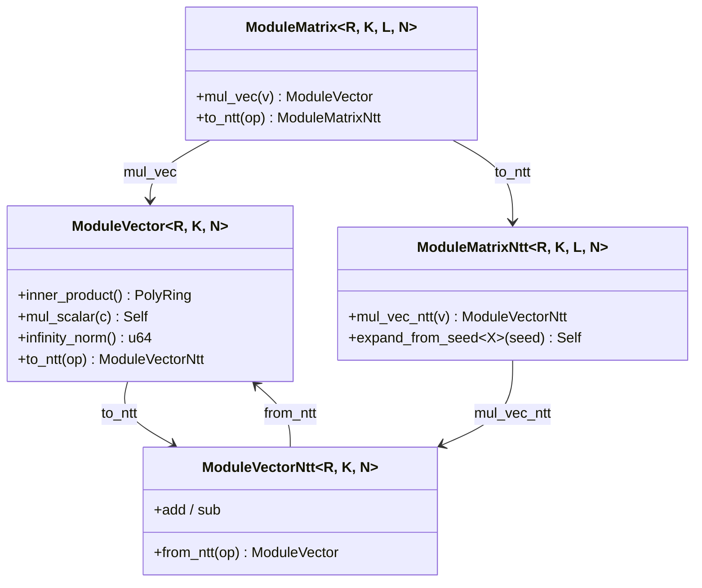

# L3 · Module Lattices

The module layer makes `R_q^K` vectors and `R_q^{K×L}` matrices first-class citizens with **dimensions in types** — the shared working object of ML-KEM, ML-DSA, Ajtai commitments and LaBRADOR-style protocols. (The legacy `GenericMatrix`/`GenericVector` containers had no lattice semantics; they remain internal only.)

## Types



Key points:

1. **Dimensions in types**: `ModuleMatrix<R, K, L, N>`; `mul_vec` requires a matching `L`-vector at compile time. Scheme parameter sets just instantiate them.
2. **NTT-domain residency**: `ModuleMatrixNtt` and `ModuleVectorNtt` hold `NttDomain` values; `mul_vec_ntt` is pure pointwise arithmetic. ML-DSA keeps `Â` resident from keygen to signature — zero transforms on the matrix.
3. **Linear-algebra completeness**: add/sub/neg, inner product, scalar (challenge) products.

## ExpandA (seed → matrix)

```rust
let a_hat: ModuleMatrixNtt<ZqD, K, L, 256> =
    ModuleMatrixNtt::expand_from_seed::<Shake128Xof>(&rho);
```

Entry `(i, j)` streams `XOF(ρ, j, i)` (single-byte indices, column first — FIPS 204 `ExpandA`) and fills coefficients by masked rejection at `q`, **directly in the NTT domain** — no transform is ever spent on the matrix. ML-KEM's coefficient-domain variant shares the same underlying sampler.

## Rounding and hints (`module::rounding`)

Per-coefficient semantics defined exactly per FIPS 204 and shared with the ZK line:

| Function | Purpose |
| --- | --- |
| `power2round(a, d) → (a1, a0)` | split `t` into `t1` (packed at 10 bits) and `t0` (13 bits) |
| `decompose(a, γ2, q) → (a1, a0)` | coarse/fine split used by `HighBits`/`LowBits`, with the `q−1` boundary case |
| `make_hint(z, r, γ2, q)` | does adding `z` to `r` move the coarse part? |
| `use_hint(a, h, γ2, q)` | correct the coarse part from the hint |

A differential test sweeps the generic definitions against the CRYSTALS-Dilithium reference bit-trick formulas; recombination and hint-recovery properties are property-tested for both γ2 values.

## Testing

- linearity: `A·(u+v) = A·u + A·v` with NTT-domain and coefficient-domain paths cross-checked;
- ExpandA determinism and manual-sampling equality;
- norm sanity (`‖0‖ = 0`, max over centered absolute coefficients);
- rounding: recombination, centered ranges, hint recovery, reference differential sweep.
