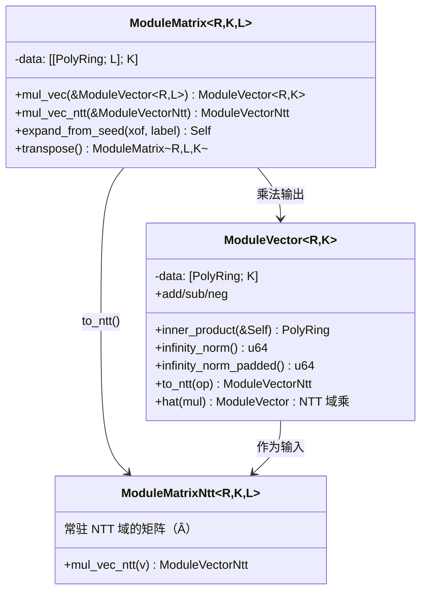

# L3 · 模格层

模格层把 `R_q` 上的**模块**（module）`R_q^k`、`R_q^{k×l}` 作为一等公民——这是 ML-KEM、ML-DSA、Ajtai 承诺、LaBRADOR 共同的工作对象。当前的 `GenericMatrix` / `GenericVector` 是元素无关的通用容器（数学上可用），但缺少格密码的**语义操作**；L3 的任务是在其上（或替代性地）给出语义化、可被方案层直接使用的类型。

## 类型体系



关键设计：

1. **维度在类型里**：`ModuleMatrix<R, K, L>` 表示 `R^{K×L}`，`mul_vec` 要求输入维度 `L`，编译期检查。方案参数集（如 `MlDsa65 { K = 6, L = 5 }`）直接实例化。
2. **NTT 域常驻**：`expand_from_seed` 可选直接产出 `ModuleMatrixNtt`（逐系数在 NTT 域采样，ML-DSA 的做法），一次变换都不省略地跳过系数域。
3. **`hat` 命名约定**：NTT 域类型统一 `XxxNtt` / 带 hat 文档标记，与文献记号一致。

## 语义操作（PQC 与 ZK 共享）

| 操作 | 签名（语义） | 使用方 |
| --- | --- | --- |
| gadget 分解 | `decompose(base, len) -> Vec<PolyRing>`（digits of a in base g） | ML-DSA t1 编码、LaBRADOR 的 small-field 分解、GreyHound |
| high/low bits | `high_bits(γ2)` / `low_bits(γ2)` / `make_hint` / `apply_hint` | ML-DSA 的 r 编码与提示 h |
| 模切换 | `mod_switch(q' )`（例如 SNARK 双环间降环） | Falcon 压缩、双环 SNARK |
| 范数 | `infinity_norm`、`l2_norm_squared`（i128 中间量）、`is_bounded(b)` | 全部方案 + ZK slack 检查 |
| 挑战作用 | `c * ModuleVector`（稀疏 × 小系数向量的快速路径） | ML-DSA、Lyubashevsky |
| 序列化钩子 | `encode(bits)` / `decode(bits)` → bit 化紧凑表示（实际打包在 L4） | 方案 |

```rust
// gadget 分解（以 base 2^g 为例）
pub trait Decompose: NegacyclicRing {
    /// 返回 [a_0, ..., a_{l-1}]，使 a = Σ a_i · base^i，|a_i| 中心化
    fn decompose_gadget(&self, g: u32, len: usize) -> Vec<Self>;
    /// ML-DSA 语义的 (a1, a0) = (high, low + 边界修正)
    fn split_bits(&self, gamma2: u64) -> (Self, Self);
    fn high_bits_hint(&self, other: &Self, gamma2: u64) -> Self; // make_hint
}
```

## 从种子扩展矩阵（Expand）

`A ∈ R_q^{k×l}` 由种子确定性生成（FIPS 203/204 的 ExpandA）。设计为泛型 over 采样分布，而非硬编码：

```rust
pub trait ExpandA: Sized {
    /// FIPS 204 风格：XOF 流上 3 字节拒绝采样（高 4 位丢弃），在 NTT 域产出
    fn expand_mldsa(seed: &[u8; 32], label: &str) -> ModuleMatrixNtt<Self, K, L>;
    /// FIPS 203 风格：XOF 流上 12-bit 拒绝采样，系数域产出
    fn expand_mlkem(seed: &[u8; 32], trans: &(u8, u8)) -> ModuleMatrix<Self, K, L>;
}
```

两族实现的差异**只在拒绝采样窗口与目标表示**，共享同一"XOF 流 → 系数"的底层函数（L4）。

## 与现有 GenericMatrix 的关系

- 短期：`ModuleVector / ModuleMatrix` 以 `PolyRing` 元素直接实现（新文件 `src/module/`），`GenericMatrix` 降级为内部工具/兼容层；
- 长期（workspace 拆分时）：`GenericMatrix` 移出公共 API，仅保留语义化的模格类型——通用容器没有格语义（范数/分解/NTT 缓存），不适合作为方案层接口。

## 并行

`Matrix × Vector` 的 `K × L` 次多项式乘法天然并行（`parallel` feature → rayon）；NTT 域矩阵-向量乘是纯逐点运算，向量化潜力最大。基准目标见[路线图](/roadmap)。

## 测试策略

- 线性性质 property test（`A·(u+v) = A·u + A·v`，跨 NTT/系数域两条路径对拍）；
- 分解性质：`Σ decompose_gadget(a)·base^i == a`；hint 一致性（`apply_hint(make_hint(z, r), r) == high_bits(z)`）；
- 范数三角不等式抽样验证；
- Expand 的 KAT（FIPS 204 附录 A 的中间向量）。
