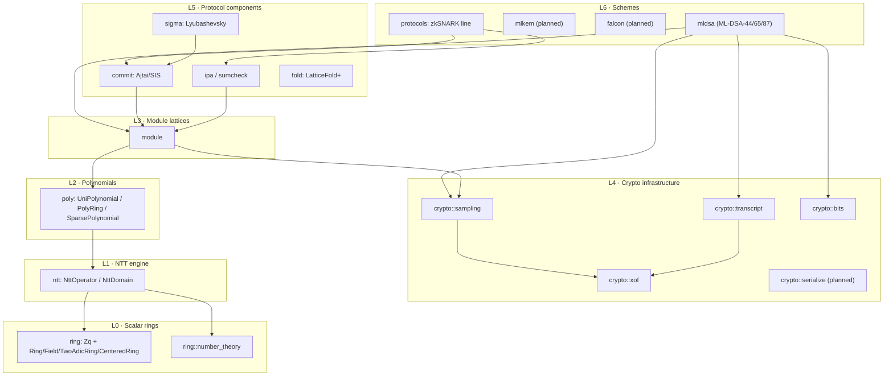

# Module Map

The authoritative inventory of every module a lattice-cryptography base
library needs, what each one owns, and its implementation status. This is the
contract between the design docs and the workspace: new code lands in the
module that owns it, and this page is updated the same day.

## Crate layout

Since W1 the repository is a cargo workspace; modules live in three crates
that share one dependency direction, plus a facade that re-exports everything
under the historical single-crate paths:

| Crate (lib name) | Path | Modules |
| --- | --- | --- |
| `lattice-algebra` (`algebra`) | `crates/algebra` | `ring`, `ntt`, `poly`, `module`, `crypto`, `matrix`, `security`, `utils` (L0–L4 + security) |
| `lattice-pqc` (`pqc`) | `crates/pqc` | `mldsa` (L6 PQC, incl. the FIPS-exact NTT `mldsa::ntt`) |
| `lattice-zk` (`zk`) | `crates/zk` | `protocols` (L5–L6 ZK line) |
| `lattice-algebra-rs` | `src/lib.rs` | facade: `pub use` of all of the above |

## Status legend

- ✅ implemented and tested
- 🚧 in progress (this milestone)
- 📋 designed, implementation scheduled (see [roadmap](/roadmap))

## L0 — Scalar rings

| Module | Owns | Status |
| --- | --- | --- |
| `ring` | `Zq<q>` const-generic ring; slim `Ring`; capability traits `Field`, `TwoAdicRing`, `CenteredRing`; compile-time `IS_PRIME` | ✅ |
| `ring::number_theory` | const Miller–Rabin, primitive roots, prime factorization, modexp | ✅ |
| `ring::reduction` *(internal, `pub(crate)`)* | modular arithmetic strategies (native 128-bit modulo today; Montgomery/lazy planned) | ✅ |
| `ring::sample` *(internal, private)* | rand-0.9 `UniformZq` sampler behind `Zq`'s `rand` support (debug/generic paths; scheme sampling lives in `crypto::sampling`) | ✅ |

## L1 — NTT engine

| Module | Owns | Status |
| --- | --- | --- |
| `ntt` | `NttOperator` / `NttOperatorOptimized` (CT-DIT, GS-DIF, negacyclic twist), precomputed twiddles, `is_ntt_friendly` | ✅ |
| `ntt` (M1) | `NttDomain<R, N>` explicit NTT-domain representation with `to_ntt` / `from_ntt` on `PolyRing` | ✅ |

Legacy runtime-parameter NTT (`ntt.rs`, `traits.rs`) was **deleted** in M0; the
const-generic engine is the only path.

## L2 — Polynomials

| Module | Owns | Status |
| --- | --- | --- |
| `poly::UniPolynomial` | generic polynomials: division (Field), evaluation, derivative, FFT fallback multiplication | ✅ |
| `poly::PolyRing` | `Zq[X]/(X^N + 1)`, automatic NTT/schoolbook dispatch, ring semantics | ✅ |
| `poly::SparsePolynomial` | τ-sparse ±1 challenges (SampleInBall output) with fast `mul_dense` | ✅ |

## L3 — Module lattices

| Module | Owns | Status |
| --- | --- | --- |
| `module` | `ModuleVector<R, K, N>`, `ModuleMatrix<R, K, L, N>` with dimensions in types; NTT-domain variants (`ModuleMatrixNtt`) so `Â` can stay transformed; `expand_from_seed` (ExpandA); norms; rounding: `power2round`, `decompose`, `make_hint`, `use_hint` (shared by ML-DSA and ZK shortness proofs) | ✅ |

## L4 — Cryptographic infrastructure

| Module | Owns | Status |
| --- | --- | --- |
| `crypto::xof` | `Xof` trait + SHAKE128/256; domain-separated, length-encoded absorb; incremental squeeze | ✅ |
| `crypto::sampling` | scheme samplers, XOF-driven and deterministic: uniform over `R_q` (masked rejection, coefficient and NTT domain), `RejBounded(η)` centered uniform (reference-exact for η ∈ {2,4}; constant-time variant `sample_rej_bounded_ct`), `CBD(η)`, `SampleInBall(τ)`, `DiscreteGaussian(σ)` (precomputed CDT; constant-time `sample_ct` inversion) | ✅ (FFT/peikert large-σ Gaussian 📋) |
| `crypto::ct` | branch-free primitives on secret-dependent data: masked select/comparisons, absolute values, infinity norms, conditional accumulation — exhaustively differential-tested against the scalar forms; scope notes for the residual leaks live in the module docs | ✅ |
| `security` | Core-SVP concrete-security estimation ([Alk+16] methodology as restated in the Dilithium r3.1 appendix and the NIST QROM evaluation): LWE primal/dual and Lyu12-SIS block sizes, `mldsa_security` scheme report, calibrated against the published 2^124/186/265 figures | ✅ |
| `crypto::transcript` | Fiat–Shamir transcript (`absorb`/`challenge_bytes`), domain-label discipline | ✅ |
| `crypto::bits` | bit-level packing/unpacking of coefficient vectors (12/13/18/20-bit), LE bit order per FIPS conventions | ✅ |
| `crypto::serialize` | canonical binary serialization + roundtrip/fuzz tests (serde stays test-only) | 📋 |

## L5 — Protocol components (ZK line)

| Module | Owns | Status |
| --- | --- | --- |
| `protocols::commitment` | Ajtai/SIS commitments `C = A·s` with short `s` (`LatticeCommitment` trait, `ExpandA` key) | ✅ (Z1) |
| `protocols::sigma` | Lyubashevsky-style approximate-knowledge Σ-protocol, FS-NIZK, forking extractor, slack analysis | ✅ (Z1) |
| `protocols::z2_ring` | `Z_{2^32}[X]/(X^64+1)` instance: raw-coefficient expansion, power-of-two fast path, toy-R1CS generator (squaring gates, ring Newton inverse) | ✅ (Z2) |
| `protocols::z2` | LaBRADOR-style batched opening: binding link + masked constraint consistency (`t*`, `q*`), ≤ 10 KB proofs for 10^4 ring constraints; gadget split + approximate linear check with provable slack | ✅ (Z2) |
| `protocols::sumcheck` | multilinear ring-sumcheck (`prove`/`verify` over any commutative ring, transcript-bound challenges) | ✅ (Z3) |
| `protocols::ipa` | gadget-IPA: inner-product arguments on Ajtai-committed vectors + approximate opening with provable slack | ✅ (Z3) |
| `protocols::fold` | LatticeFold+/IVC folding: relaxed R1CS instances `(z, E, c_z, c_E)`, homomorphic fold `z' = z1 + rz2`, `E' = E1 + r²E2 + rT` (cross terms), folding verifier. Transparent (not ZK); full compact IVC deferred | ✅ (Z4) |

## L6 — Schemes

| Module | Owns | Status |
| --- | --- | --- |
| `mldsa` | ML-DSA-44/65/87 (FIPS 204): parameter ZSTs, `SigningKey`/`VerifyingKey`, deterministic & hedged signing, hint machinery, FIPS encodings; per-set API modules (`mldsa::mldsa_65::…`) | ✅ (KAT alignment 📋) |
| `mlkem` | ML-KEM-512/768/1024 (FIPS 203), incl. the layered NTT instance | 📋 (M4) |
| `falcon` | Falcon-512/1024 (FIPS 206 draft), float FFT sampler sub-module | 📋 (M5) |

## Cross-cutting

| Concern | Owner | Status |
| --- | --- | --- |
| Ring-axiom property tests (≥ 8 moduli) | `ring::axiom_tests` | ✅ (15 moduli) |
| KAT framework (FIPS vectors, ACVP) | `tests/kats/` + per-scheme tests | 🚧 (M3) |
| Benchmarks (criterion) | `benches/` in every crate (`cargo bench --workspace`) | ✅ (CI thresholds 📋) |
| Documentation site (this site) | `docs/` | ✅ |

## Rules of thumb

1. **New capability → new trait in the owning layer**, not an extension of a
   layer-agnostic trait.
2. **Dependencies point downward only**; the allowed edge set is drawn in the
   diagram above.
3. **Determinism**: scheme-facing APIs take seeds/labels (XOF-driven), not bare
   RNGs; randomness is injected once at the top.
4. **Every module ships with its tests in the same PR**; scheme modules also
   ship KATs or documented cross-checks.
