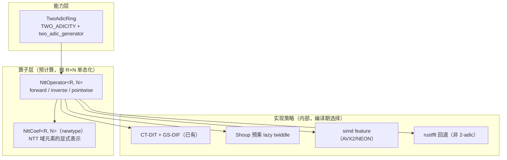

# L1 · NTT 引擎

NTT（数论变换）是所有 NTT 友好参数集的性能心脏：ML-KEM / ML-DSA 的矩阵-向量乘、LaBRADOR 的批量打开、GreyHound 的 sumcheck 全部依赖它。

## 现状

`src/ntt/ntt_core.rs`（目标路径）：

- `NttOperator<R: Ring, const N: usize>`：const 泛型算子，构造时预计算 `NttParams`（ψ、ω）与 `NegacyclicTwiddles`；
- forward：Cooley–Tukey radix-2 DIT；inverse：Gentleman–Sande radix-2 DIF；
- `forward_negacyclic_with_psi` / `inverse_negacyclic_with_psi`：先乘 ψ^k 做 "twist"，把 negacyclic 卷积归约到 cyclic NTT；
- `pointwise_mul`、`multiply` / `multiply_negacyclic`；
- `is_ntt_friendly::<R>(n)` 运行时判定（`n` 为 2 的幂且 `q ≡ 1 (mod 2n)`）。

遗留：`src/ntt/ntt.rs` 的运行时参数版（`NttTable::with_params`、基于 `NttConfig` 的 `KyberNttConfig` / `DilithiumNttConfig` 等）——计划合并删除（见[审计](/introduction/audit)）。

## 数学结构

negacyclic 环 `R_q = Z_q[X]/(X^n + 1)` 的乘法归约为 `2n`-点 cyclic 卷积：

```
设 ψ 是 2n 次本原单位根（ψ² = ω），a' = a · (ψ^k)_{k=0..n-1}（"twist"）
NTT(a·b) = NTT(a) ⊙ NTT(b)   （⊙ 为逐点乘）
```

可 NTT 化的充要条件：`n` 为 2 的幂且 `q ≡ 1 (mod 2n)`，即 `q-1` 的 2-adicity ≥ `log2(n) + 1`。三个目标参数集全部满足：

| 参数集 | q | q−1 的 2-adicity | n | 2n |
| --- | --- | --- | --- | --- |
| ML-KEM | 3329 | 7（3328 = 2^7·26） | 256 | 512 ✅（Kyber 用专门的非标准 NTT，见下） |
| ML-DSA | 8380417 | 23 | 256 | 512 ✅ |
| Falcon | 12289 | 12 | 512/1024 | 1024/2048 ✅（Falcon 用 FFT，见下） |

> **ML-KEM 特例**：`q = 3329` 满足 `q ≡ 1 (mod 2n)`，但 FIPS 203 使用的是**不完全 NTT**（`Z_q[X]/(X^256+1)` 在该 q 下分裂为 128 个 2 次因子的积，NTT 域元素是 128 个二次多项式 `Z_3329[X]/(X²+ζB)`），本库的通用 negacyclic NTT 在数学上仍可用（完整 256 点 NTT 域），但为与规范互操作，L1 需额外提供 FIPS 203 分层 NTT 的实例（作为 `PolyRing` 的另一表示实现，不影响 trait）。

> **Falcon 特例**：FIPS 206 草案的多项式乘法允许 NTT 或 FFT 两条路径；规范参考实现用浮点 FFT（配合快速傅里叶采样共用变换）。本库将把 Falcon 的浮点路径作为独立采样/采样-乘法混合模块放在 L6，L1 只提供整数 NTT 用于验证与可选路径。

## 目标设计



核心 API（设计目标）：

```rust
/// NTT 域表示。不变式：持有的是规范顺序（或位反转序——见下）的逐点值。
pub struct NttDomain<R: TwoAdicRing, const N: usize>([R; N]);

impl<R: TwoAdicRing, const N: usize> PolyRing<R, N> {
    pub fn to_ntt(&self, op: &NttOperator<R, N>) -> NttDomain<R, N>;
    pub fn from_ntt(v: NttDomain<R, N>, op: &NttOperator<R, N>) -> Self;
}

impl<R: TwoAdicRing, const N: usize> NttDomain<R, N> {
    /// NTT 域加法（即系数域加法）
    pub fn add(self, rhs: &Self) -> Self;
    /// NTT 域乘法 = 系数域卷积
    pub fn mul(self, rhs: &Self) -> Self;
}
```

设计要点：

1. **`NttDomain` newtype 是"表示自由"原则的落点**。ML-DSA 的矩阵 `Â`、LaBRADOR 的承诺矩阵都应在 NTT 域**常驻**，方案代码显式控制变换次数；同时 `PolyRing * PolyRing` 默认路径仍自动分派（现状行为保留）。
2. **twiddle 布局**：预计算 + Shoup 预乘（`u64` 存 `w·2^32` 形式，乘法用 hi 半积），把每次 butterfly 的模乘降为一次乘加；这是 ML-DSA 参考实现的做法。
3. **顺序约定**：API 对外暴露**规范顺序**（自然序），内部允许位反转序优化，通过 `bit_reverse` 门控在 `from_ntt` 收尾——文档明确序约定，避免跨层误用。
4. **单态化膨胀控制**：`NttOperator::<R, N>` 的 twiddle 表为 `const` 惰性静态（`std::sync::OnceLock` 或内联数组），N 取值受限于 `poly_ring` 已有的 dispatch 白名单（2…1024），超出走 schoolbook/FFT。
5. **cyclic 支持**：为 Falcon 验证路径与部分 SNARK 参数（cyclic 子环采样）提供 `CyclicRing`（mod `X^n − 1`），复用同一引擎（去掉 twist）。

## 常时时间

L1 全程数据无关控制流（butterfly 次数只依赖 `n`），满足 CT；twiddle 表是公共常量，无密钥泄漏面。

## 测试策略

- 与 schoolbook 乘法交叉验证（所有白名单 `N` × 每个实例化 `q`）；
- `forward ∘ inverse = id`；`NTT(a)⊙NTT(b) == NTT(a·b)`；
- 与 ML-DSA 参考实现的 NTT 中间值 KAT（冻结几组固定输入的变换输出）对拍；
- 性能回归：criterion 基准（`n = 256 @ q = 8380417`，`n = 512/1024 @ q = 12289`）。
