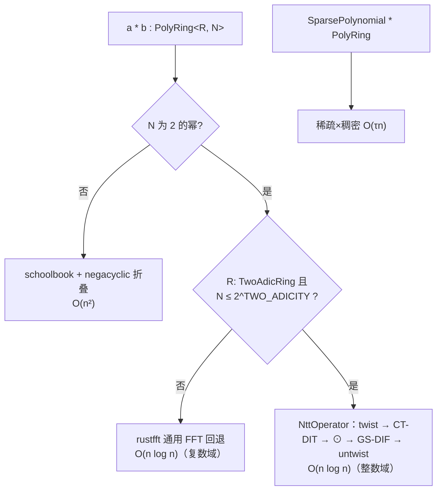

# L2 · 多项式与商环

L2 在标量环之上提供两个互补的抽象：

- `UniPolynomial<R>`：**通用**多项式（可变长、支持除法/插值/求导）——SNARK 的算术语言；
- `PolyRing<R, N>`：**定长**商环 `Z_q[X]/(X^N + 1)`——格密码的工作马。

## 现状

| 组件 | 状态 | 说明 |
| --- | --- | --- |
| `UniPolynomial<R>` | ✅ | 升幂系数、Horner 求值、带余除法、导数、标量乘、FFT（rustfft）乘法 |
| `PolyRing<R, N>` | ✅ | negacyclic 归约（`X^(n+k) ≡ −X^k`）、NTT 自动分派、`MatrixElement` |
| NTT 分派 | ✅ | `is_ntt_available()` → `ntt_multiply_sized`（2…1024 白名单）→ schoolbook 回退 |
| serde | ✅ | 系数域表示 |

## 目标变化

### 1. 表示无关的商环 trait

现有 `PolynomialQuotientRing` 把内部表示钉死为 `UniPolynomial`（`modulus()` 返回具体类型）。目标改为面向**语义**的能力 trait：

```rust
pub trait NegacyclicRing: Sized {
    type Coeff: TwoAdicRing;           // NTT 能力上移到系数环
    const DEGREE_BOUND: u64;

    // 表示切换
    fn to_ntt(&self, op: &NttOperator<Self::Coeff, { N }>) -> NttDomain<...>;
    fn from_ntt(v: NttDomain<...>) -> Self;

    // 语义操作
    fn infinity_norm(&self) -> u64;    // 建立在 L0 CenteredRing 上
    fn high_bits(&self, gamma2: u64) -> Self;   // ML-DSA/承诺用（也可在 L3）
    fn decompose(&self, base: u64, len: usize) -> Vec<Self>; // gadget 分解

    // 采样构造（L4 挂载）
    fn from_coefficient_slice(coeffs: &[Self::Coeff]) -> Self;
    fn sample_uniform(xof: &mut impl Xof, label: &str) -> Self;
    fn sample_cbd(xof: &mut impl Xof, eta: u32) -> Self;
    fn sample_in_ball(xof: &mut impl Xof, tau: u32) -> Self;  // τ-稀疏挑战
}
```

### 2. 稀疏多项式

`SampleInBall` 产出的挑战 `c` 只有 `τ` 个非零系数（ML-DSA：τ ∈ {39, 49, 60}）。挑战-相关的乘法 `c·s_i`（`s_i` 小系数）用**稀疏 × 稠密** O(τn) 比 NTT 更快：

```rust
pub struct SparsePolynomial<R: Ring> {
    /// (系数符号, 位置) 对，位置升序
    terms: Vec<(i8, usize)>,
    degree_bound: usize,
}
impl<R: TwoAdicRing> SparsePolynomial<R> {
    pub fn mul_dense(&self, dense: &PolyRing<R, N>) -> PolyRing<R, N>;
}
```

### 3. cyclic 商环

`CyclicPolyRing<R, N>`（mod `X^n − 1`）：Falcon 验证、部分 SNARK 参数、rounding 研究用。与 negacyclic 共用 L1 引擎（无 twist），文档显式标注两者不可混用（类型系统隔离：不同类型即不同环）。

### 4. SNARK 需要的通用多项式扩展

`UniPolynomial` 保留并补齐 SNARK 算术所需：

- 多点求值 / 拉格朗日插值（小规模，`O(n²)` 起步）；
- 商多项式 `f(X) / Z_H(X)`（除法已有）；
- 批量逆（Montgomery 批量求逆技巧）。

这部分**不**走 NTT（通用域上），性能定位为"正确优先"，与 plonky3 的 LDE 思路区分：格 SNARK 的域是 `R_q`，大规模多点求值在 L3/L5 以 NTT 域完成。

## 乘法分派全景



## 测试策略

- 环公理（`PolyRing` 组合测试宏跨 `(R, N)` 实例化）；
- 三条乘法路径一致性（NTT vs FFT 回退 vs schoolbook，同一输入逐系数对拍）；
- negacyclic 折叠性质：`X^N ≡ −1`（现有 `test_multiplication_with_wraparound` 扩展为 property test）；
- 稀疏乘法与稠密乘法一致性。
