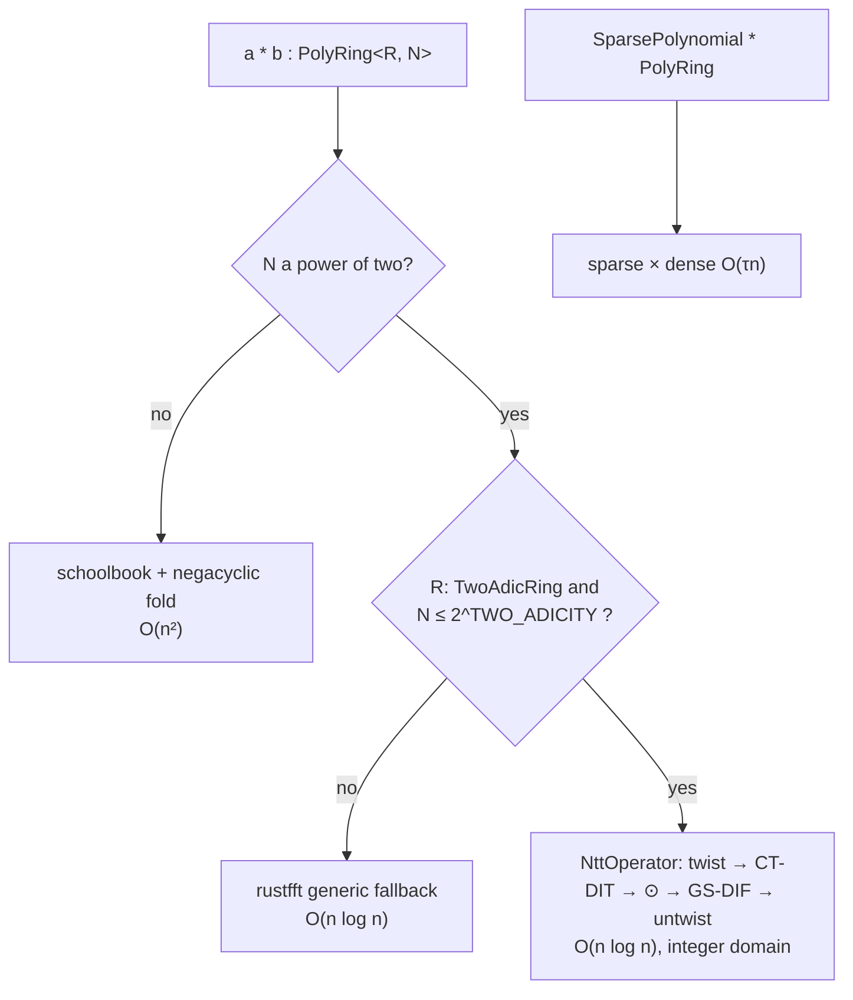

# L2 · Polynomials

Two complementary abstractions:

- `UniPolynomial<R>` — **generic** polynomials (variable length, division/evaluation/derivative): the SNARK arithmetic language;
- `PolyRing<R, N>` — **fixed-length** quotient ring `Z_q[X]/(X^N+1)`: the lattice workhorse.

## Generic polynomials

Ascending coefficients, Horner evaluation, division with remainder (requires `R: Field` — division is a field operation), derivative, scalar product, and an FFT-based fallback multiplication (rustfft) for non-2-adic moduli. SNARK-grade extensions (batch inversion, interpolation) are scheduled.

## The negacyclic ring

`PolyRing<R, N>` reduces via `X^(n+k) ≡ −X^k`. `new()` uses a pure ring-op block fold, so arbitrary-degree inputs reduce without polynomial division and without any `Field` bound.

### Multiplication dispatch



All three dense paths are cross-checked by differential tests.

## SparsePolynomial (M1)

SampleInBall challenges have exactly `τ` non-zero ±1 coefficients. `SparsePolynomial<R>` stores `(sign, position)` pairs and multiplies a dense polynomial in `O(τ·N)` via monomial rotations — faster than the NTT path for challenge products:

```rust
let c = SparsePolynomial::<ZqD>::from_sign_vector(&signs, 256);
let cs1 = s1_vec.mul_scalar(&c_poly);
```

## Cyclic ring

`Z_q[X]/(X^n − 1)` (for Falcon verification and some SNARK parameters) is designed as a separate type sharing the L1 engine without the twist — type-level isolation prevents negacyclic/cyclic mixing. Scheduled with the Falcon milestone.

## Testing

- ring axioms instantiated across `(R, N)` pairs;
- three multiplication paths (NTT / FFT fallback / schoolbook) cross-checked on identical inputs;
- `X^N ≡ −1` wraparound property tests;
- sparse-vs-dense multiplication equivalence.
