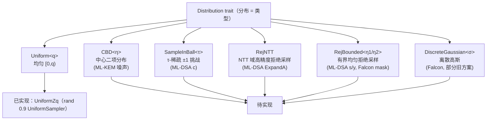

# L4 · 采样层

格密码的安全性 = **问题难度 × 参数 × 采样分布的正确性**。ML-DSA 的 MSIS 归约要求挑战与噪声的分布精确匹配规范；Falcon 的高斯采样直接决定签名的泄漏面。因此采样层是独立的 L4 子系统：**接口吃 XOF（确定性），分布是类型**。

## 采样器家族



## 接口设计

```rust
/// XOF trait（本层配套，见哈希页）
pub trait Xof {
    fn absorb(&mut self, data: &[u8]);
    fn squeeze(&mut self, out: &mut [u8]);
    /// 常用语法糖：块式挤出（SHAKE 一次 r=136/168 字节块）
    fn squeeze_block<const R: usize>(&mut self) -> [u8; R];
}

/// 分布 trait：所有采样器统一入口
pub trait Distribution {
    type Output;
    /// 从 XOF 流采样（确定性、域分隔）
    fn sample(&self, stream: &mut impl XofStream) -> Self::Output;
}
```

设计要点：

1. **XofStream 抽象**：分布实现消费的是"字节流"（带域分隔前缀），而不是完整 XOF——同一分布既能从 SHAKE 流采样，也能从测试用伪随机流采样。
2. **拒绝采样是分布的内部细节**，但对外的语义是"精确分布"；每个实现必须带**接受率测试**（统计检验）。
3. **方案参数经泛型注入**：`CBD::<3>`、`SampleInBall::<39>`——参数错误在编译期暴露，而不是运行时。

## 各分布实现要点

### CBD(η) — 中心二项分布

`Σ(2b_i − 1)`（每系数 2η 随机位）。用于 ML-KEM 全部噪声与 ML-DSA 的 `s1, s2`（η = 2/4）。实现：XOF 块内位重用 + 位掩码，无分支。范数恒 ≤ η，`is_bounded` 可特化为常量比较。

### SampleInBall(τ) — 稀疏挑战

τ 个非零位置、全 ±1（FIPS 204：先 RejBounded 采样位置，再用符号位）。实现用拒绝式 Fisher–Yates；**必须验证**输出恰有 τ 个非零且位置分布均匀（KAT 直接对拍 FIPS 204 附录）。

### RejBounded(η1) — 有界均匀

`[−η1+1, η1]` 中心化（ML-DSA 的 y、s）。从字节流取 η1+1 位，中心化映射，拒绝超界。

### RejNTT / 高精度均匀 — ExpandA

NTT 域系数需要覆盖 `q` 的接近满区间（ML-DSA：3 字节采样、丢弃高 4 位、拒绝 ≥ q）。这是 `ModuleMatrix::expand_from_seed` 的底层（见 L3）。

### DiscreteGaussian(σ) — Falcon 核心

FIPS 206 草案 Falcon 路径：

- **base sampler**：CDT（累积分布表）+ 高精度比较，σ₀ 固定（约 1.17·… 基准值），常时时间表扫描（无早退）；
- **fast Fourier sampling**：利用 falcon 环结构的 Gram 矩阵 LU 分解（由 `sk` 计算），把多维高斯化为 base 采样的组合，需要浮点 FFT——独立子模块 `gaussian::fft_sampler`，**显式标注非常时时间**（与规范参考实现一致的权衡，掩码化是后续研究项）；
- 精度策略：`f64` 对齐参考实现；提供 `gaussian_fidelity` 测试（Kolmogorov–Smirnov 检验 + 与参考 CDT 对拍）。

> `ring/sample.rs` 中已声明的 `GaussianSampler` trait 将迁移至此并落地。

## 安全与测试

| 测试 | 目的 |
| --- | --- |
| KAT 对拍（FIPS 203/204 附录向量） | 分布精确性 |
| 卡方 / KS 统计检验 | 大样本分布形状 |
| 接受率（rejection rate）上界断言 | 防拒绝循环偏置 / DoS |
| 域分隔一致性（不同 label 输出不同） | 防 label 冲突 |
| `cargo fuzz`（XOF 流字节翻转 → 不 panic、分布不漂移） | 鲁棒性 |

采样输出默认携带 `Debug` 禁用（密钥材料不应打印）：输出类型实现 `Debug` 时输出 `[REDACTED]`。
