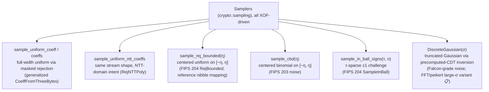

# L4 · Sampling

Lattice security = problem hardness × parameters × **sampling correctness**. MSIS-based soundness requires challenges and noise to match the specified distributions exactly, so the sampling layer is a standalone subsystem: **the interface takes XOF streams (deterministic); distributions are functions with exact semantics.**

## Sampler family



## Design

```rust
/// Bit reader over an XOF stream (LSB-first within each byte).
pub struct BitStream<'a, X: Xof> { /* ... */ }

pub fn sample_uniform_coeff<R: Ring>(stream: &mut BitStream<'_, impl Xof>) -> R;
pub fn sample_rej_bounded<R: Ring>(stream: &mut BitStream<'_, impl Xof>, eta: u32) -> i64;
pub fn sample_cbd<R: Ring>(stream: &mut BitStream<'_, impl Xof>, eta: u32) -> i64;
pub fn sample_in_ball_signs(stream: &mut BitStream<'_, impl Xof>, tau: u32, n: usize) -> Vec<i8>;
```

1. **Streams, not RNGs.** Callers absorb seeds and labels into an `Xof` first; samplers consume the stream. Determinism, KATs and reproducible signing follow.
2. **Rejection is an internal detail**; the external semantics is the exact distribution. Every implementation ships acceptance-range and statistical tests.
3. **Bit conventions match the specifications**: bits LSB-first within bytes, bytes in stream order.
4. **Parameter errors are compile-time** where possible (`CBD::<3>`-style generics at the module layer); bounds are checked at runtime with clear panics.

## Implementation notes

- `sample_uniform_coeff` generalizes FIPS 204 `CoeffFromThreeBytes`: `bitlen(q−1)` bits assembled little-endian, masked, reject `≥ q`. Acceptance ≈ 0.9998 for `q = 8380417`.
- `sample_rej_bounded` follows the reference implementation bit-for-bit for `η ∈ {2, 4}` (nibble sampling: η=2 accepts `t < 15` and maps `2 − (t mod 5)` via the multiply-shift trick; η=4 accepts `t < 9` and maps `4 − t`). Other η use a generic uniform-on-`[−η, η]` fallback.
- `sample_in_ball_signs` consumes 8 sign bytes (64 sign bits, used in order) plus one rejection byte per filled position — exactly FIPS 204 `SampleInBall`.
- `DiscreteGaussian(σ)` is implemented as a precomputed-CDT table in `2^127` fixed point — one draw is 16 stream bytes plus a binary search, no rejection loop, fully deterministic given the stream. A constant-time `sample_ct` (full masked scan instead of the binary search) is provided for secret-randomizer contexts. This is the noise primitive Falcon/FN-DSA needs; the *fast Fourier* large-σ variant from the Falcon reference remains a Falcon-milestone item and will be feature-gated with its non-CT status documented.

## Testing

| Test | Purpose |
| --- | --- |
| determinism (same stream → same output) | XOF-driven semantics |
| range containment + both-tails presence | distribution sanity |
| full-coverage sweep for small `q` | uniformity |
| mean test for CBD (`|mean| < 0.2` at n = 4000) | centered binomial shape |
| exact `τ` non-zeros for SampleInBall | challenge structure |
| termination under rejection (Dilithium modulus, NTT-domain sampler) | no livelock |
| Gaussian: determinism, tail containment, centered peak (`gaussian_*` tests) | CDT semantics |
