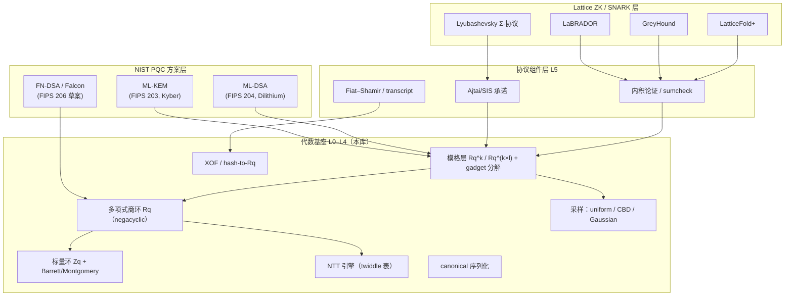

# Lattice Algebra RS

> **定位：格密码生态的 arkworks / plonky3。**
> 一套统一的代数基础库，向上同时支撑 **NIST PQC 方案**（ML-KEM / ML-DSA / Falcon）与 **lattice-based zkSNARK**（LaBRADOR / GreyHound / LatticeFold 风格）。

## 为什么需要一个统一基座

所有主流格密码方案几乎共享同一套数学结构：

- **标量环** `Z_q`（NTT 友好素数，如 `q = 8380417`、`q = 3329`、`q = 12289`）
- **多项式商环** `R_q = Z_q[X]/(X^n + 1)`（negacyclic，`n = 256/512/1024`）
- **模格** `R_q^{k×m}` 上的矩阵 / 向量运算
- **NTT**（`q ≡ 1 (mod 2n)` 时的 O(n log n) 乘法）
- **结构化采样**（均匀、CBD、稀疏挑战、离散高斯）
- **Fiat–Shamir** 与 hash-to-polynomial

区别只在于**参数**与**上层协议组合方式**。过去为每个方案从 spec 手写一套实现，导致：

1. 同样的环运算 / NTT / 采样被反复实现，无法互相复用与交叉验证；
2. 参数硬编码，无法做通用性的研究实验（换 q、换 n、换采样分布）；
3. PQC 方案与 ZK 协议之间没有共享的承诺、范数、分解等原语。

本项目的目标是把这些公共结构抽成 **trait 驱动、const 泛型参数化** 的基础库，让每个具体方案变成"参数表 + 薄协议层"。

## 设计即文档

本站采用"**设计文档 = 使用文档 = 参考文档**"三位一体的组织方式：

| 板块 | 内容 | 面向 |
| --- | --- | --- |
| [入门](/introduction/getting-started) | 现有 API 的可运行示例 | 使用者 |
| [架构设计](/design/architecture) | L0–L6 分层设计、trait 能力体系、关键决策 | 使用者 + 贡献者 |
| [上层方案](/schemes/pqc) | PQC 方案到基座 API 的映射表 | 实现者 |
| [参考](/reference/trait-map) | trait 地图、参数集、生态对比 | 实现者 + 研究者 |
| [路线图](/roadmap) | 里程碑、验收标准 | 所有人 |

所有架构图使用 Mermaid 绘制，与代码仓库同步演进；每个设计页面中的代码示例标注了「当前 API」或「设计目标 API」两种状态。

## 当前状态

- **已有**：`Zq<MODULUS>` 标量环（Barrett 归约）、`UniPolynomial`、`PolyRing<R, N>`（negacyclic，NTT 自动分派）、通用矩阵 / 向量、均匀采样、serde 支持。
- **设计完成、待实现**：模格层、XOF/采样、Fiat–Shamir、序列化、方案层。
- 详见 [现状审计与差距分析](/introduction/audit) 与 [路线图](/roadmap)。
