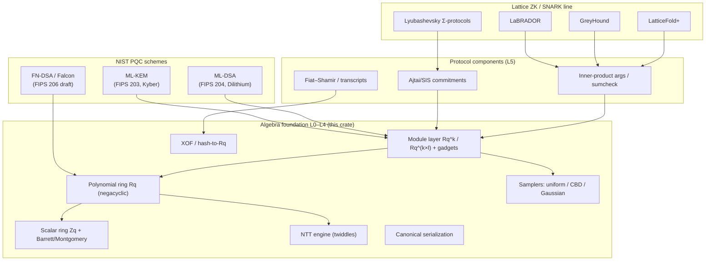

# Lattice Algebra RS

> **Positioning: the arkworks / plonky3 of lattice-based cryptography.**
> One unified algebra foundation from which **NIST PQC schemes** (ML-KEM / ML-DSA / Falcon) and **lattice-based zkSNARKs** (LaBRADOR / GreyHound / LatticeFold-style) derive directly.

## Why a unified foundation

Nearly all mainstream lattice schemes share the same mathematical objects:

- **Scalar ring** `Z_q` (NTT-friendly primes: 8380417, 3329, 12289, 2^32, …)
- **Polynomial quotient ring** `R_q = Z_q[X]/(X^n + 1)` (negacyclic, n = 256/512/1024)
- **Module lattices**: matrices and vectors over `R_q`
- **NTT** for `O(n log n)` multiplication when `q ≡ 1 (mod 2n)`
- **Structured sampling** (uniform, CBD, sparse challenges, discrete Gaussian)
- **Fiat–Shamir** and hash-to-polynomial

Schemes differ only in **parameters** and **how these pieces are composed**. Implementing each scheme from its specification by hand leads to:

1. ring arithmetic, NTTs and samplers re-implemented per scheme, impossible to cross-check;
2. hard-coded parameters, blocking research experiments;
3. no shared commitment/norm/decomposition primitives between PQC and ZK lines.

This project factors the common structure into a **capability-trait-driven, const-generic** base library so that every scheme becomes "a parameter table + a thin protocol layer".

## Status

- **L0–L2** (scalar rings with `Ring`/`Field`/`TwoAdicRing`/`CenteredRing`, NTT engine with explicit NTT-domain representation, polynomial rings, sparse challenges): **implemented**.
- **L3** (module vectors/matrices with type-level dimensions, NTT-domain caching, ExpandA, rounding/hints): **implemented**.
- **L4** (XOF, samplers, Fiat–Shamir transcripts, bit packing): **implemented**.
- **L6 PQC**: **ML-DSA-44/65/87 implemented and tested**; ML-KEM and Falcon scheduled next.
- **L5/L6 ZK**: designed, scheduled per the [roadmap](/roadmap).

See the [module map](/design/module-map) for the authoritative inventory, and the [quickstart](/introduction/getting-started) for runnable examples.

## Documentation as design

This site follows a "design = usage = reference" organization:

| Section | Contents | Audience |
| --- | --- | --- |
| [Getting started](/introduction/getting-started) | runnable examples of the current API | users |
| [Design](/design/architecture) | layering, capability traits, key decisions | users + contributors |
| [Module map](/design/module-map) | the complete module inventory and status | contributors |
| [Schemes](/schemes/pqc) | PQC algorithms mapped to base APIs | implementers |
| [Reference](/reference/trait-map) | trait map, parameter sets, ecosystem | implementers + researchers |
| [Roadmap](/roadmap) | milestones and acceptance criteria | everyone |

All architecture diagrams are Mermaid and evolve together with the code.
