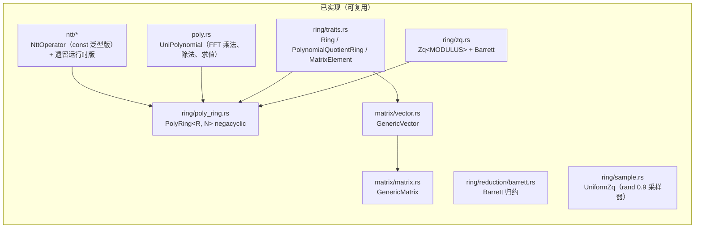

# 现状审计与差距分析

本页对照[目标架构](/design/architecture)，逐模块盘点**现有实现**与**目标设计**的差距。审计基于当前 `main` 分支源码（约 6.6k 行 Rust）。

## 现有模块一览

## 差距矩阵

| 层 | 模块 | 现状 | 目标 | 差距等级 |
| --- | --- | --- | --- | --- |
| L0 | 标量环 `Zq<q>` | ✅ const 泛型、Barrett、serde、幂/逆 | 拆分能力 trait（`Field` / `TwoAdicRing`）；居中代表元与 `∞`-范数；Montgomery / lazy reduction 优化路径；常时时间策略 | 中 |
| L1 | NTT | ✅ const 泛型 `NttOperator`（negacyclic、twiddle 预计算） | 删除遗留运行时版（`ntt.rs`）；NTT 域表示 `NttDomain`；Shoup lazy twiddle；cyclic NTT（Falcon / SNARK 需要） | 中 |
| L2 | 多项式 | ✅ `UniPolynomial` + `PolyRing` 自动分派 | 稀疏多项式（τ-稀疏挑战）；NTT 域缓存类型；`from_ntt` / `to_ntt` 显式接口 | 小 |
| L3 | 模格 | ⚠️ `GenericMatrix`/`GenericVector` 是**元素无关**的通用容器 | 语义化 `ModuleVector<Rq, K>` / `ModuleMatrix<Rq, K, L>`；gadget 分解、high/low bits、hint、模切换；范数与 bound check | **大** |
| L4 | 采样 | ⚠️ 仅均匀采样 | CBD(η)、`SampleInBall`（τ-稀疏挑战）、XOF 驱动的均匀拒绝采样（rej bounded / rej NTT）、离散高斯（Falcon） | **大** |
| L4 | 哈希 / FS | ❌ 无 | `Xof` trait（SHAKE128/256）、hash-to-polynomial（FIPS 204）、transcript / Fiat–Shamir、种子扩展 | **大** |
| L4 | 序列化 | ⚠️ 仅 serde JSON（调试用） | canonical 二进制序列化（ark-serialize 风格）+ 方案级位打包（12-bit / 13-bit / 23-bit） | 中 |
| L5 | 协议组件 | ❌ 无 | Ajtai/SIS 承诺 trait、Σ-协议脚手架、FS 变换 | 大（ZK 路线） |
| L6 | PQC 方案 | ❌ 无 | ML-KEM / ML-DSA / Falcon + 官方 KAT | 大 |
| L6 | ZK / SNARK | ❌ 无 | Lyubashevsky → LaBRADOR → GreyHound / LatticeFold+ 分阶段 | 大 |
| 工程 | 测试 / 基准 | ⚠️ 单元测试齐全；criterion 仅挂桩 | 环公理 property test、FIPS KAT、ACVP 向量、基准看板 | 中 |
| 工程 | 宏测试 | ✅ `matrix_test_macro` / `vector_test_macro` 跨元素类型批量实例化 | 沿用并扩展到模格层 | 小 |

## 已识别的代码级问题

1. **两套并行 NTT 实现**：`src/ntt/ntt.rs`（运行时参数 `NttTable`、`with_params`、基于 `NttConfig` 的 `KyberNttConfig` 等）与 `src/ntt/ntt_core.rs`（const 泛型 `NttOperator<R, N>`，`PolyRing` 实际使用的路径）。目标：保留 const 泛型版，把 `NttConfig` 里有价值的信息（根 of unity 常量表）合并为 `TwoAdicRing` trait 的关联常量。
2. **`Ring` trait 过重**：要求 `Ord + Display + Div + MatrixElement` 等，导致通用性受限。目标：拆分为最小能力 trait 组合（见 [L0 设计](/design/scalar-ring)）。
3. **`PolynomialQuotientRing` 依赖 `UniPolynomial` 具体类型**：`modulus()` 返回 `UniPolynomial<R>`，使 trait 对内部表示不透明。目标：表示无关（coeffs / NTT 域 / CRT 混合）。
4. **未使用的 `GaussianSampler` trait**：`ring/sample.rs` 中已声明但无实现，应挪到 L4 采样层并给出真实实现（CDT 采样器）。
5. **`ntt/mod.rs` 文档示例的泛型签名错误**（写成 `NttOperator::<Zq3329, 256>` 但旧签名不同）——重构时一并修正 doctest。
6. **README 引用路径过期**：`ring::vector_arithmatic` 模块已改名。

## 重构原则

- **先立 trait、后迁移实现**：L0/L2 的新 trait 先落地并让现有类型实现，方案层再依赖新 trait，避免大爆炸重构。
- **保留 `PolyRing` 现有自动分派**作为语义，性能细节（NTT 域缓存、SIMD）作为内部优化。
- 每一步迁移都保持 `cargo test` 绿，KAT 作为回归护栏。
