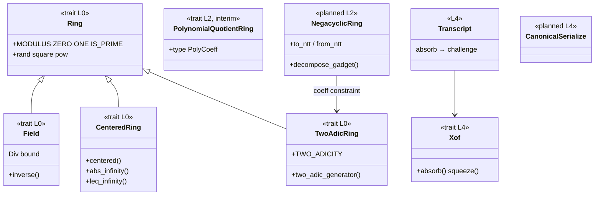

# Trait Map (current → target)

The one-page map of the trait layout: what exists today, what replaced what, and where new code belongs. This page is the review baseline for refactors.

## Current capability traits



## Migration ledger

| Legacy item | Fate | Status |
| --- | --- | --- |
| `Ring` god-trait (Ord/Display/Div/MatrixElement mixed in) | split into slim `Ring` + `Field` + `CenteredRing` + `TwoAdicRing` | ✅ |
| `MatrixElement` | internal requirement of the legacy matrix containers only | ✅ demoted |
| `PolynomialQuotientRing` (representation-bound) | interim; replaced by `NegacyclicRing`/`CyclicRing` capabilities | 📋 M4+ |
| `NttConfig` + runtime `NttTable`/`NttOperator` (`ntt.rs`, `traits.rs`) | deleted; constants absorbed into `TwoAdicRing` | ✅ |
| `GenericVector`/`GenericMatrix` as public API | replaced by `ModuleVector`/`ModuleMatrix` (dimensions in types, lattice semantics) | ✅ for scheme use; containers now internal |
| `UniformZq` (rand-0.9 sampler) | kept for generic/debug paths; scheme sampling lives in `crypto::sampling` | ✅ |
| `GaussianSampler` stub | to be realized as `DiscreteGaussian` (Falcon milestone) | 📋 |
| Barrett module | reduction strategy enum (native 128-bit today; Montgomery/lazy planned) | ✅ core / 📋 strategies |

## Layering rules (dependency direction)

```text
L0 ring      → nothing
L1 ntt       → L0
L2 poly      → L0, L1
L3 module    → L2 (+ L4 samplers/xof for ExpandA — documented exception)
L4 crypto    → L0–L3
L5 protocols → L3, L4            (planned)
L6 schemes   → L5 (ZK) or L3+L4 (PQC)
```

Review checklist for new code:

1. imports must not skip layers;
2. scheme layers depend only on parameter-set ZSTs and base traits, never on concrete ring types;
3. new capabilities are new traits in the owning layer — never additions to `Ring`;
4. deterministic APIs take XOF streams/seeds, never `&mut Rng`.
