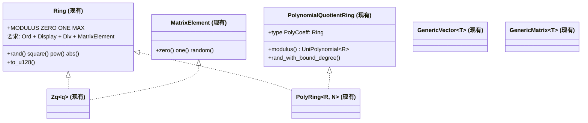
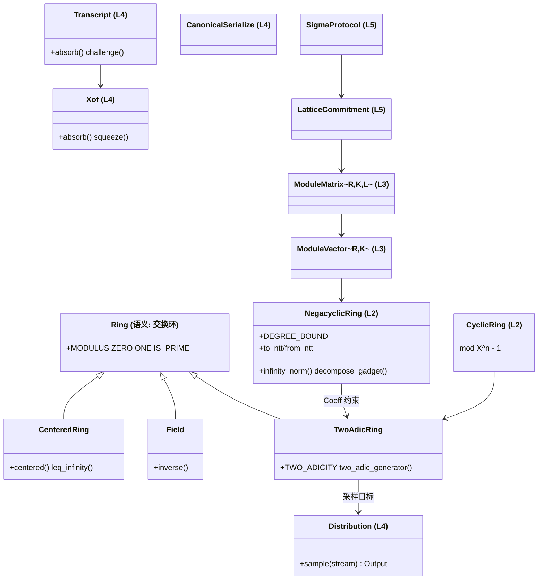

# Trait 地图（现状 → 目标）

全库的 trait 布局一图流：**左侧为现有实现，右侧为设计目标**。此页是重构与代码评审的对照基准。

## 现状



现有问题：`Ring` 混入了展示/排序/除法/矩阵元素四类不相关能力；商环 trait 依赖具体多项式表示；矩阵类型无格语义。

## 目标



## 迁移对照表

| 现有符号 | 目标去向 | 动作 |
| --- | --- | --- |
| `Ring` | `Ring`（瘦身）+ `Field` + `CenteredRing` + `TwoAdicRing` | 拆分；`Ord/Display` 移到 `Zq` 具体类型；`Div` 只留在 `Field` |
| `MatrixElement` | 内部实现细节（不再是公共 trait） | 模格层改用 `ModuleVector/ModuleMatrix` |
| `PolynomialQuotientRing` | `NegacyclicRing` / `CyclicRing` | 表示无关；`modulus()` 移除（类型即模数） |
| `Zq<MODULUS>` | 保留，实现新 trait 族 | 增 `IS_PRIME`、`centered`、CT 逆 |
| `UniPolynomial<R>` | 保留（通用路径） | 增插值/批量逆；标 `SNARK 算术` 用途 |
| `PolyRing<R, N>` | 保留，实现 `NegacyclicRing` | 增 `NttDomain` 互转、范数、分解 |
| `NttOperator<R, N>`（ntt_core） | 保留 | twiddle Shoup 化、`OnceLock` 静态表 |
| `NttTable` / 旧 `NttOperator` / `NttConfig`（ntt.rs） | 删除 | 有价值常量并入 `TwoAdicRing` 关联常量 |
| `GenericVector<T>` / `GenericMatrix<T>` | `ModuleVector<R, K>` / `ModuleMatrix<R, K, L>` | 维度入类型；语义操作新增；旧类型私有化 |
| `UniformZq` | L4 `Uniform` 分布 | 归入 `Distribution` 家族 |
| `GaussianSampler`（空壳） | L4 `DiscreteGaussian` | 迁移 + 实现 CDT / FFT 采样器 |
| barrett（`reduction/barrett.rs`） | 保留为 L0 内部策略 | 增加 Montgomery / Shoup 策略枚举 |

## 依赖方向（防止循环依赖的规则）

```text
L0 ring      → 无依赖
L1 ntt       → L0
L2 poly      → L0, L1
L3 module    → L2
L4 crypto    → L0–L3（Xof/采样/序列化/transcript）
L5 protocols → L3, L4
L6 schemes   → L5（ZK 线）或 L3+L4（PQC 线）
```

评审新代码时检查两件事：导入是否越层；是否绕过 trait 直接依赖具体类型（方案层只允许依赖参数集 ZST 与基座 trait）。
