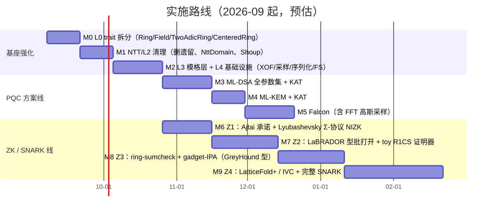

# 路线图

按"**先把基座立稳，方案层直线叠加**"排序。每个里程碑都有明确验收标准；预估工期为单人投入的粗估，随实施滚动修订。

## 里程碑明细与验收标准

### M0 · L0 标量环重构

- `Ring` 瘦身，新增 `Field` / `TwoAdicRing` / `CenteredRing`（见 [L0 设计](/design/scalar-ring)）；
- 删除遗留 NTT 运行时路径（[审计问题 1](/introduction/audit)）。
- **验收**：`cargo test` 全绿；环公理 property test 宏覆盖 ≥ 8 个 `q` 实例；`cargo clippy -D warnings` 干净。

### M1 · NTT 与 L2 清理

- `NttDomain` newtype + `to_ntt/from_ntt`；twiddle Shoup 预乘；`is_ntt_friendly` 转为 `TwoAdicRing` 能力判定；
- `SparsePolynomial` + `SampleInBall` 占位；cyclic 环类型。
- **验收**：三条乘法路径（NTT/FFT/schoolbook）交叉对拍 property test；NTT criterion 基准落档。

### M2 · L3 模格 + L4 基础设施

- `ModuleVector/ModuleMatrix(/Ntt)`、`expand_from_seed`、gadget 分解、hint、范数；
- `Xof`（SHAKE128/256）、分布家族（Uniform/CBD/RejBounded/RejNTT）、`XofTranscript`、`CanonicalSerialize` + `BitPack`。
- **验收**：FIPS 204 ExpandA / ExpandMask 中间值 KAT；roundtrip + fuzz（deserialize 不 panic）；线性性质 property test。

### M3 · ML-DSA（第一个"直线叠加"的证明）

- `MlDsa44/65/87` 参数集 ZST；KeyGen/Sign/Verify；确定性签名。
- **验收**：ACVP/官方 KAT 全通过；签名尺寸常量断言（2420/3309/4627 B）；基准（sign/verify µs 级）落档。**这是架构正确性的试金石**——若基座设计不成立，M3 会最先暴露。

### M4 · ML-KEM

- 同上模式；注意 FIPS 203 分层 NTT 兼容实例（[L1 特例](/design/ntt)）。
- **验收**：KAT 全通过；encaps/decaps 隐式拒绝语义测试。

### M5 · Falcon

- FFT 高斯采样器（独立子模块，声明非常时时间）；压缩编码。
- **验收**：与参考实现对拍（签名字节级）；范数验证边界测试。草案冻结前不发布稳定版 API。

### M6–M9 · ZK 线（详见 [ZK 页](/schemes/zk-snark)）

- **验收**（逐阶段）：Z1 提取器测试 + estimator 校准记录；Z2 toy R1CS ≤ 10 KB 证明；Z3 与 Z2 对拍 + 基准发布；Z4 端到端 10^6 约束级基准 + IVC 正确性 property test。

## 工程守则（贯穿全程）

1. 每个里程碑合并前：`cargo test` + `cargo clippy -D warnings` + `cargo doc` 无警告；
2. KAT 先行：先冻结向量文件，再写实现（红→绿）；
3. 文档同步：新 trait 落地当天更新对应设计页与 trait 地图（PR 模板勾选项）；
4. 性能回归：criterion 基准纳入 CI（阈值告警），数据归档到 `bench/`；
5. 安全审计点清单（范数/中心化/分解/FS 域分隔）作为共享组件改动的必审项。
