# Roadmap

Ordered by "stabilize the foundation first, layer schemes straight on top". Every milestone has acceptance criteria; estimates are rolling single-contributor approximations.

## Progress

```mermaid
flowchart LR
    subgraph DONE["Completed ✅"]
        M0["M0 · L0 trait refactor<br/>Ring/Field/TwoAdicRing/CenteredRing<br/>legacy NTT deleted, 15-moduli axioms"]
        M1["M1 · NTT/L2 cleanup<br/>NttDomain, SparsePolynomial"]
        M2["M2 · L3 modules + L4 infra<br/>ModuleVector/Matrix, ExpandA,<br/>XOF, samplers, transcripts, bit packing"]
        M3["M3 · ML-DSA 44/65/87<br/>sign/verify + encodings + tests"]
        M6["M6 · Z1 Σ-protocols"]
        M7["M7 · Z2 batched openings"]
        M8["M8 · Z3 sumcheck + IPA"]
        M9["M9 · Z4 folding + SNARK"]
        W1["W1 · Multi-crate workspace<br/>algebra / pqc / zk + facade"]
        W2["W2 · Hardening: ACVP KATs,<br/>constant-time, calibrated levels"]
    end
    subgraph NEXT["Next"]
        M4["M4 · ML-KEM + KATs"]
        M5["M5 · Falcon"]
    end
    M0 --> M1 --> M2 --> M3
    M3 --> M6 --> M7 --> M8 --> M9 --> W1
    W1 --> W2
    W2 --> M4
    W2 --> M5
```

## Milestones and acceptance criteria

### ✅ M0 · Scalar-ring refactor

- Slim `Ring`; new `Field` / `TwoAdicRing` / `CenteredRing` ([L0 design](/design/scalar-ring));
- legacy runtime NTT path deleted ([audit](/introduction/audit));
- **gate (met)**: `cargo test` green; ring-axiom property tests over ≥ 8 moduli (delivered: 15); `cargo clippy -D warnings` clean.

### ✅ M1 · NTT & L2 cleanup

- `NttDomain` newtype with `to_ntt`/`from_ntt`; `SparsePolynomial` with `mul_dense`;
- **gate (met)**: three multiplication paths (NTT/FFT/schoolbook) cross-checked; domain-op equivalence tests.

### ✅ M2 · Module layer + crypto infrastructure

- `ModuleVector`/`ModuleMatrix` (+ NTT variants), `expand_from_seed` (ExpandA), rounding/hints, norms;
- `Xof` (SHAKE128/256), samplers (uniform / CBD / RejBounded / SampleInBall / NTT-domain), `Transcript`, bit packing;
- **gate (met)**: determinism tests, distribution sanity, linearity property tests, malformed-codec rejection.

### ✅ M3 · ML-DSA (the architecture litmus test)

- `MlDsa44/65/87` ZSTs; `keygen`/`sign_deterministic`/`sign_with_randomness`/`verify`; FIPS 204 encodings;
- **gate (met)**: roundtrip + determinism + tamper/context/wrong-key rejection for all parameter sets; exact size assertions (2420/3309/4627 B signatures); key serialization roundtrips. **KAT/ACVP alignment landed** in W2 (126 official vectors green).

### M4 · ML-KEM

- Same pattern; includes the spec's layered NTT instance ([L1 note](/design/ntt)).
- **Gate**: official KATs; implicit-rejection semantics tests.

### M5 · Falcon

- FFT Gaussian sampler (isolated sub-module, non-CT documented); compression encodings.
- **Gate**: byte-level agreement with the reference; norm-verification edge cases. No stable release before the draft freezes.

### ✅ M6 · Z1 Σ-protocol primitives

- `protocols::commitment` (Ajtai/SIS) + `protocols::sigma` (Lyubashevsky approximate-knowledge FS-NIZK) on the Z1 instance;
- **gate (met)**: extractor test (exact relaxed relation `A·s_ext = v·t`, honest-case `s_ext = v·s`, slack bounds `‖s_ext‖∞ ≤ 2·B_Z`, `‖v‖₁ ≤ 2·TAU`); HVZK via rejection sampling; full slack analysis published on the [Z1 page](/schemes/z1-sigma). Estimator calibration remains an open hardening item.

### ✅ M7 · Z2 batched openings

- `protocols::z2_ring` (`Z_{2^32}` instance) + `protocols::z2` (batched opening with masked constraint consistency, gadget split with provable slack);
- **gate (met)**: 10^4-ring-constraint toy R1CS, transparent proof ≈ 3 KB (budget 10 KB); extractor relation test; tamper/wrong-instance rejection; wire roundtrip. Schwartz–Zippel soundness sketch published on the [Z2 page](/schemes/z2-batched).

### ✅ M8 · Z3 ring-sumcheck + gadget-IPA

- `protocols::sumcheck` (multilinear sumcheck over any commutative ring) + `protocols::ipa` (inner-product arguments with gadget-based approximate opening);
- **gate (met)**: cross-checked against Z2 on the same toy R1CS instance — both paths accept the identical instance/witness; sizes asserted (3072 B Z2 / 5376 B Z3) and timings benchmarked (see the [Z3 page](/schemes/z3-sumcheck) table).

### ✅ M9 · Z4 folding layer

- `protocols::fold`: Nova-style folding over the Z2 ring — relaxed R1CS instances with homomorphic commitment updates, cross-term absorption, folding verifier, IVC chain test (6 folds, all verify);
- **gate (met)**: all folded chain instances pass verify_folded; r=0 identity; tampered error rejected. Full compact IVC (non-transparent) deferred to the research layer.

### ✅ W1 · Multi-crate workspace

- Split the single crate into a cargo workspace: [`lattice-algebra`](/design/module-map) (L0–L4: ring / ntt / poly / module / crypto / matrix), `lattice-pqc` (ML-DSA), `lattice-zk` (protocols), plus the `lattice-algebra-rs` facade that re-exports every module under its historical path;
- public-API audit: all 353 public items carried over verbatim (before/after surface diff empty);
- primitives audit: `crypto::sampling` gains the `DiscreteGaussian` precomputed-CDT sampler (the Falcon noise primitive); the dead `ring::sample::GaussianSampler` stub removed;
- **gate (met)**: `cargo test --workspace` (454 tests), `cargo clippy --workspace --all-targets -- -D warnings` and `cargo fmt --check` all clean.

### ✅ W2 · Hardening: KAT/ACVP, constant time, calibrated levels

- `mldsa::ntt`: the FIPS 204 NTT (ζ = 1753, bit-reversed evaluation order) — `ExpandA` reproduces the official `RejNTTPoly` streams; the base `algebra::ntt` engine stays generic;
- official ACVP fixtures (keyGen 75 / sigGen 27 / sigVer 24, pure mode) with provenance + regeneration script; **found and fixed** a one-sided `r0` restart gate via the vectors;
- `crypto::ct` branch-free primitives; ML-DSA norm gates, rounding/hints, sampler value mappings and encodings hardened; CT variants for `RejBounded` and the CDT Gaussian; `SigningKey` zeroization + redacted `Debug`;
- `algebra::security`: Core-SVP estimation (LWE primal/dual, Lyu12-SIS) calibrated against the published ML-DSA figures; Z1 instances calibrated (Σ soundness 2^225.7 classical);
- **gate (met)**: `cargo test --workspace` green incl. the ACVP harness; `cargo clippy --workspace --all-targets -- -D warnings` and `cargo fmt --check` clean; block sizes frozen as regression tests.

### ZK line remaining work (details in the [ZK page](/schemes/zk-snark))

- **Remaining**: ZK blinding; the LaBRADOR recursion for Z2/Z3 (committing the masked terms before the challenges open them — the one-shot masked-term check contributes one bit of soundness, audited and documented). W3 protocol audit landed: non-unit challenge fix for Z2/IPA (a vacuous-check break), corrected Nova cross-term algebra in Z4 with a homomorphic error fold, sumcheck verifier closure, and gate-level parallelism (`parallel` feature: Z2 prove/verify −78% at 512 gates). Estimator calibration and the ML-DSA KAT/ACVP alignment landed in W2.

## Engineering rules (always on)

1. Before merge: `cargo test` + `cargo clippy -D warnings` + `cargo fmt --check`, no warnings;
2. KAT-first: freeze vectors, then implement (red → green);
3. docs same-day: new traits update the relevant design page and the [trait map](/reference/trait-map);
4. performance: criterion benches ship per crate (`cargo bench --workspace` — algebra foundation, ML-DSA keygen/sign/verify, Z1–Z4 protocols); wire CI thresholds before the next release;
5. shared audit points (norms/centering/decomposition/FS separation) are mandatory review items for the L3/L4 APIs both lines depend on.
