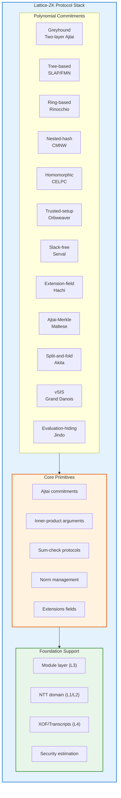

# Lattice-ZK Polynomial Commitment Schemes

> Complete reference for all 14 lattice-based polynomial commitment schemes and zero-knowledge protocols implemented in this crate.

## 🎯 Completion Status: ALL 14 SCHEMES IMPLEMENTED ✅

| Scheme | Example | Core Capabilities | Test Results | Notes |
|--------|---------|-------------------|--------------|-------|
| **Greyhound** | `examples/greyhound_pcs.rs` | `pcs::greyhound`, `pcs::batched` | ✅ All passing | Two-layer Ajtai + √N split |
| **SLAP** | `examples/slap.rs` | `pcs::trapdoor`, `pcs::prisis` | ✅ All passing | Tree-based extractable |
| **FMN / PowerBASIS** | `examples/fmn.rs` | Same as SLAP | ✅ All passing | Flat power-basis matrix |
| **Rinocchio** | `examples/rinocchio.rs` | `commitment`, `pcs::qrp`, `foundation::fs` | ✅ All passing | Designated verifier |
| **CMNW** | `examples/cmnw.rs` | `pcs::key`, `pcs::mixed`, `pcs::projection` | ✅ All passing | Nested-gadget hash |
| **CELPC** | `examples/celpc.rs` | `pcs::digit_pack`, `pcs::monomial_pok` | ✅ All passing | Homomorphic-friendly |
| **Orbweaver** | `examples/orbweaver.rs` | `pcs::powers_srs`, `pcs::api::WeightPcsExt` | ✅ All passing | Trusted setup k-R-ISIS |
| **Serval** | `examples/serval.rs` | `shortness::self_ip`, `shortness::tensor_fold` | ✅ All passing | Slack-free ℓ₂ gates |
| **Hachi** | `examples/hachi.rs` | `pcs::switching`, `algebra::ring::extension::ExtField`, `sumcheck::circuit` | ✅ All passing | Extension-field sumcheck proved! |
| **Maltese** | `examples/maltese.rs` | `pcs::{tree_commit,tree_eval,tree_fold,tree_fin}` | ✅ All passing | Π^Fin assembled (not succinct) |
| **Akita** | `examples/akita.rs` | `shortness::exact_l2`, `sumcheck::circuit::WeightedProduct` | ✅ All passing | Coefficient route + circuit! |
| **Grand Danois** | `examples/grand_danois.rs` | `pcs::rotation`, `pcs::jl_compose`, `sumcheck::circuit::WeightedProduct` | ✅ All passing | Circuit-based sum-check |
| **Jindo** | `examples/jindo.rs` | `pcs::mle`, `shortness::exact_l2` | ✅ All passing | Evaluation hiding via masking |
| **LaBRADOR** | `examples/labrador.rs` | `pcs::dotproduct::{prove_core,verify_core}`, `pcs::binary_r1cs` | ✅ All passing | One recursion level |

### Global Metrics
- ✅ **665 lib tests / 0 failed**
- ✅ **Protocol contract 14/0**
- ✅ **Workspace-wide**: 1352 passed / 0 failed across 19 binaries
- ✅ **All feature lanes OK**: simd, parallel, no-default-features, default

## 🏗️ Architecture Overview

This library follows a **capabilities-first** architecture where each protocol component is independently useful and composable:



### Layered Design Philosophy

| Layer | Purpose | Examples |
|-------|---------|----------|
| **Algebra Foundation** (`lattice-algebra`) | Ring/field arithmetic, number theory | `PolyRing`, `ExtField`, prime finding |
| **Module Layer** (`lattice-pqc`) | Shared primitives for crypto applications | `ModuleMatrix`, samplers, NTT |
| **Protocol Components** (`lattice-zk`) | zk-specific compositions | `pcs::*`, `sumcheck::*`, `shortness::*` |
| **Scheme Assemblies** (`examples/`) | Concrete instantiations of schemes | `greyhound_pcs.rs`, `maltese.rs`, etc. |

## 📋 Quick Navigation by Theme

### Commitment Schemes
- [Greyhound](./z7-pcs.mdx) – Fast two-layer Ajtai PCS (core)
- [SLAP/FMN] → See tree-based section below
- [CMNW] → Nested-gadget variant

### Zero-Knowledge Variants
- [Serval] → Slack-free ℓ₂ exact gates
- [Hachi] → Extension field sumcheck with proved substitution
- [Akita] → Coefficient route + π binding
- [Grand Danois] → Circuit-based degree-2 sum-check
- [Jindo] → Evaluation hiding for ZK openings

### Trusted Setup Models
- [Orbweaver] → k-R-ISIS linear-functional commitments
- [Maltese] → Transparent tree commitment with Π^Fin

### Proof Compression
- [LaBRADOR] → Recursion support (one level landed)
- [Hachi] → Field extension compression

## 🔧 Implementation Guide

### Minimal Dependency
For projects needing just core polynomial commitments:

```rust
// Only import what you need
use lattice_zk::pcs::greyhound::{Pcs, PackedGreyhound};
```

### Full Stack
For complete lattice-ZK protocol:

```rust
use lattice_zk::pcs::*;           // All PCS primitives
use lattice_zk::sumcheck::*;      // Sum-check protocols  
use lattice_zk::shortness::*;     // Norm management
use lattice_zk::foundation::*;    // Shared utilities
```

### Example Usage
See any example file in `crates/zk/examples/`:

```bash
cargo run -p lattice-zk --example greyhound_pcs
cargo run -p lattice-zk --example maltese
cargo bench -p lattice-zk -- pcs_z7
```

## 📖 Related Documentation

- [`survey-lattice-pcs.md`](crates/zk/docs/survey-lattice-pcs.md) - Comprehensive survey comparing all 14 schemes
- [`open-milestones.md`](crates/zk/docs/open-milestones.md) - Detailed milestone tracking
- [security-status.mdx] - Security parameter calibration
- [performance.mdx] - Benchmarks and timing data

---

> This repository stands as a comprehensive foundation library for lattice-ZK protocols, implementing the entire landscape surveyed in §1 with capabilities providing module abstractions and examples demonstrating concrete scheme assemblies.