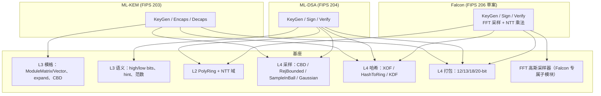
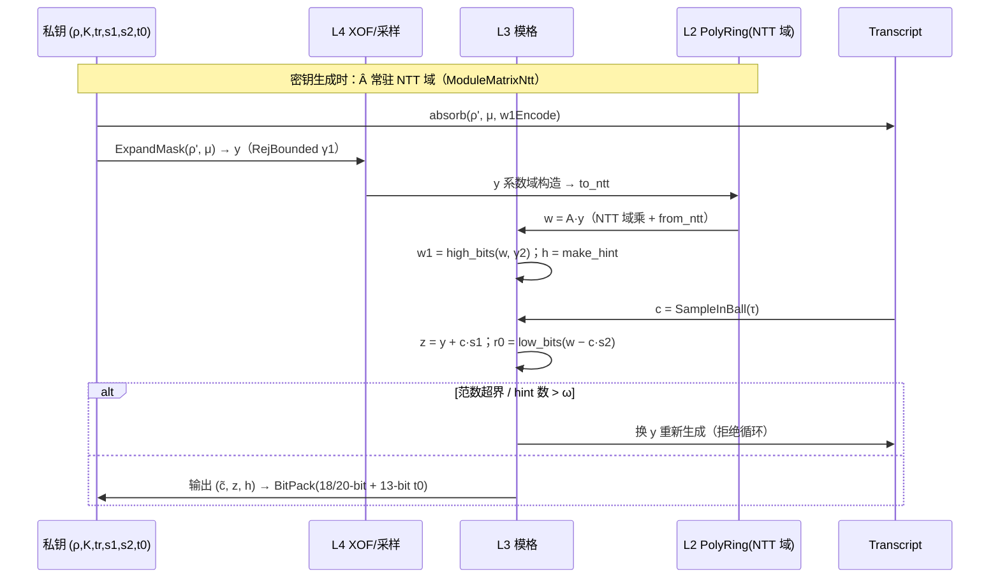

# NIST PQC 映射

本页展示三个格基 NIST 方案如何"直线"落在基座上——**每个方案算法步骤 → 基座 API**。方案本身退化为：参数表 + 调用顺序 + 打包规则。

> 范围说明：NIST PQC 签名 = ML-DSA（FIPS 204）+ FN-DSA/Falcon（FIPS 206 草案）；SLH-DSA（FIPS 205）是**基于哈希**的方案，不使用格代数，不在本库范围。KEM = ML-KEM（FIPS 203）。

## 方案 → 基座组件依赖图

## ML-KEM（FIPS 203）

参数：`q = 3329, n = 256, k ∈ {2,3,4}, η1 ∈ {3,2,2}, η2 = 2, d_u ∈ {10,10,11}, d_v ∈ {4,5,7}`。

| 规范步骤 | 基座 API |
| --- | --- |
| `PRF(s, b)` / `J(s)` | `Xof::new("ML-KEM …") + squeeze` |
| `H(x)` | `Shake256` 固定 32 字节输出 |
| `G(x) = (ρ, σ)` | KDF（SHAKE256 双 32 字节输出） |
| `Â ← ExpandA(ρ)` | `ModuleMatrix::expand_mlkem`（12-bit 拒绝采样，系数域） |
| `s, e ← CBD_η` | `CBD::<η1>` 逐多项式采样 → `ModuleVector` |
| NTT / 逆 NTT、`⊙` | `PolyRing::to_ntt / from_ntt`、`NttDomain::mul`（注意：FIPS 203 的 NTT 域是 128 个二次因子域，见 L1 特例说明——本库提供规范兼容的分层 NTT 实例） |
| 密文压缩 `d_u, d_v` | `BitPack::pack_compressed` |
| `K, r ← KEM(…)` | 封装解封装结果经 `J`/`SHAKE256`（隐式拒绝） |

**验收**：官方 KAT（ACVP: ML-KEM-encap-FIPS203 等向量）全通过；加解密 roundtrip property test。

## ML-DSA（FIPS 204）

参数：`q = 8380417, n = 256`；三参数集见[参数集页](/reference/parameter-sets)。

| 规范组件 | 基座 API |
| --- | --- |
| `ExpandA(ρ)` | `ModuleMatrix::expand_mldsa`（NTT 域，3 字节拒绝采样） |
| `ExpandMask(ρ', μ)` | `RejBounded::<γ1>` over `XofTranscript` |
| `SampleInBall` | L4 分布 `SampleInBall::<τ>` → `SparsePolynomial` |
| `c·s1, c·s2` | `SparsePolynomial::mul_dense` × `ModuleVector`（O(τn) 快速路径） |
| `w1/w0, hint` | L3 `split_bits(γ2)` / `make_hint` / `apply_hint` |
| 范数检查 | L0 `leq_infinity`（CT）+ L3 `is_bounded` |
| 编码 | L4 `BitPack`（18/20/13-bit、c̃ 原样） |
| `H` 摘要 μ | `Xof`（SHAKE256，含 tr 域分隔） |

**验收**：ACVP ML-DSA-44/65/87 全向量 + 确定性签名 KAT；拒绝循环计数分布 sanity。

## Falcon / FN-DSA（FIPS 206 草案）

参数：`q = 12289, n = 512/1024, σ ≈ 1.17·√(q/2n) 级`；密钥结构 `(B̂, ŷ)` 的 FFT 域 Gram 分解。

| 规范组件 | 基座 API |
| --- | --- |
| 多项式环 `Z_q[X]/(X^n+1)` | `PolyRing<Zq<12289>, n>`（NTT 路径） |
| FFT 域密钥结构 | Falcon 专属子模块（浮点 `Complex<f64>` FFT，复用 `rustfft` planner） |
| hash-to-point | `HashToRing`（`c = SHAKE(...)` → 拒绝采样到系数域） |
| 签名采样 | `gaussian::fft_sampler`（base CDT + 快速傅里叶采样） |
| 范数验证 | L0/L3 范数 API（`⌈1.17√q⌉` 界） |
| 编码 | L4 打包（14-bit pk、变长签名） |

**风险与策略**：草案仍在演进；实现以参考实现行为为锚，API 面收窄在子模块内，参数冻结前不进主干 release。

## 公共横切关注点

- **密钥材料零化**：方案层 SK 结构实现 `Drop → zeroize`（feature `zeroize`）；
- **旁路声明**：ML-KEM/ML-DSA 主路径可做成 CT；Falcon 浮点采样器**声明为非常时时间**（与参考实现一致）；
- **隐式拒绝**：KEM 封装失败与签名拒绝循环都通过重派生实现，方案层不允许把失败原因区分泄露；
- **KAT 框架**：`tests/kats/` 放官方向量 JSON/hex，按层复用（L1/L2 中间值向量 → 方案最终向量）。
