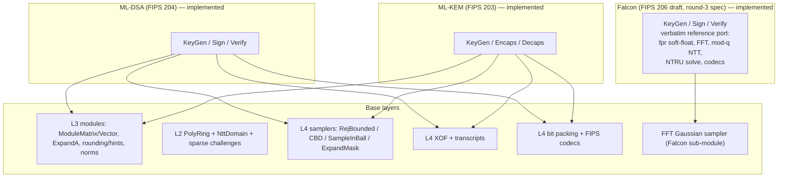

# NIST PQC Mapping

How the lattice NIST schemes land **directly** on the base library — all of it inside the `lattice-pqc` crate (`pqc::mlkem`, `pqc::mldsa`, `pqc::falcon`), built on `lattice-algebra` (plus `sha3` for the fixed-length FIPS hashes): every specification step maps to a base API, and schemes reduce to *parameter tables + call order + packing rules*. Falcon is the one exception — a verbatim port of the round-3 reference implementation in self-contained sub-modules.

> Scope: KEM = ML-KEM (FIPS 203, **implemented**); signatures = ML-DSA (FIPS 204, **implemented**) + Falcon/FN-DSA (FIPS 206 draft, **implemented** against the round-3 spec — reference-anchored until the FIPS 206 freeze; **no stable release before then**). SLH-DSA (FIPS 205) is hash-based, not lattice — out of scope.

## Scheme → base dependency graph

## ML-DSA (FIPS 204) — implemented

Parameter sets `ML-DSA-44/65/87` are zero-sized types implementing `MlDsaParams`; all algorithms are generic over the trait with const-generic module dimensions bound per set (see [parameters](/reference/parameter-sets)).

| Specification step | Base API |
| --- | --- |
| `H`, `G`-style derivations | `crypto::xof` (`Shake256Xof`, one-shot shortcuts) |
| `ExpandA(ρ)` | `ModuleMatrixNtt::expand_from_seed` — `XOF(ρ, j, i)`, masked rejection, NTT-domain direct |
| `ExpandS(ρ')` | `sampling::sample_rej_bounded` over `H(ρ' ‖ 2-byte idx)` |
| `ExpandMask(ρ', μ)` | `y = γ1 − chunk` unpacking of `H(ρ' ‖ 2-byte (κ+i))` |
| `SampleInBall(c̃)` | `sampling::sample_in_ball_signs` → `SparsePolynomial` |
| `c·s1`, `c·s2`, `c·t0` | `ModuleVector::mul_scalar` (sparse/dense products) |
| `w ← NTT⁻¹(Â∘NTT(y))` | `ModuleMatrixNtt::mul_vec_ntt` (Â resident in the NTT domain) |
| `Power2Round`, `HighBits`/`LowBits` | `module::rounding` |
| `MakeHint` / `UseHint` | `module::rounding` |
| norm gates (`‖z‖∞`, `‖r0‖∞`, `‖c·t0‖∞`, `#h ≤ ω`) | `CenteredRing::abs_infinity` + module norms |
| `pkEncode`/`skEncode`/`sigEncode` | `mldsa::encoding` |

Acceptance (all green in CI):

- sign/verify roundtrip for all three parameter sets;
- deterministic signing reproducibility; hedged variant via explicit `rnd`;
- tampered message / wrong context / wrong key / corrupted signature → rejection;
- exact encoded sizes: signatures 2420 / 3309 / 4627 B, public keys 1312 / 1952 / 2592 B, secret keys 2560 / 4032 / 4896 B;
- key roundtrip through the canonical byte encodings.

**Done**: official KAT/ACVP alignment — 126 pure-mode vectors (keyGen/sigGen/sigVer) pass byte-exactly, powered by the FIPS 204 NTT (`mldsa::ntt`); see [security status](/introduction/security-status). Measured keygen/sign/verify costs: [Performance](/reference/performance). Deployment readiness: [Security status](/introduction/security-status).

## ML-KEM (FIPS 203) — implemented

Parameter sets `ML-KEM-512/768/1024` are zero-sized types implementing `MlKemParams`. The scheme carries its own seven-layer NTT (`mlkem::ntt`) because `q = 3329` has 2-adicity 7: the transform bottoms out in 128 pairs living in `Y^2 − ζ^(2·brv7(i)+1)`, so all NTT-domain products go through the spec's `BaseCaseMultiply`.

| Specification step | Implementation |
| --- | --- |
| `H`, `J`, `PRF` | SHA3-256 / SHAKE-256 (`sha3`) |
| `G` (with the `‖k` domain byte) | SHA3-512, split 32+32 |
| `Â[i,j] ← SampleNTT(ρ‖j‖i)` | `mlkem::ntt::expand_a` — 12-bit rejection, NTT-domain direct |
| `s, e ← CBD_η(PRF(σ, N))` | `mlkem::sample_cbd` (consecutive η-bit chunks, Algorithm 8) |
| NTT products | `mlkem::ntt::mul_ntts` / `pointwise_mul_add` (`BaseCaseMultiply`) |
| `Compress_d`/`Decompress_d`, `ByteEncode_d`/`ByteDecode_d` | `mlkem::encoding` |
| FO transform, implicit rejection | `mlkem::decapsulate` — `J(z ‖ c)` on re-encryption mismatch |
| `ekEncode`/`dkEncode` + §7 key checks | `EncapsulationKey`/`DecapsulationKey` `to_bytes`/`from_bytes` |

Acceptance (all green in CI):

- 183 official ACVP vectors byte-exact: keyGen 75 (all sets), encaps 24, decaps 24 including implicit-rejection cases, and 60 `EncapsulationKeyCheck`/`DecapsulationKeyCheck` decisions;
- encaps/decaps roundtrip, deterministic encapsulation, tamper + wrong-length ciphertext rejection for all three parameter sets;
- exact encoded sizes: ek 800 / 1184 / 1568 B, dk 1632 / 2400 / 3168 B, ct 768 / 1088 / 1568 B;
- key roundtrips through the canonical byte encodings.

Measured keygen/encaps/decaps costs: [Performance](/reference/performance).

## Falcon / FN-DSA (FIPS 206 draft) — implemented (round-3 spec)

`pqc::falcon` is a verbatim port of the Falcon round-3 reference
implementation (2020-10-01 spec): integer soft-float `fpr` (bit-exact with
the C `fpr.c`, differentially tested over 13 000 random operand cases),
complex FFT, mod-q NTT (Montgomery), the recursive RNS NTRU-solver chain
with Babai reduction, the ChaCha20 sampler with the AVX2-interleaved output
layout, LDL-tree FFT signing and the compressed-signature codecs. Both
parameter sets (`falcon::falcon512`, `falcon::falcon1024`) expose the same
per-set API:

| API | Notes |
| --- | --- |
| `keygen(seed: &[u8; 48])` | SHAKE256-expanded entropy, exactly like the reference |
| `sign(sk, msg, nonce, sig_seed)` | 40-byte nonce + 48-byte signing seed (fresh uniform randomness); returns header ‖ compressed s2 |
| `verify(pk, msg, nonce, esig)` | **mirrors `sign`** — same message/nonce split, no pre-concatenation of `nonce ‖ message` |
| `public_key_from_bytes` / `secret_key_from_bytes` | canonical encodings with length/modulus checks |

Acceptance (all green in CI):

- official round-3 submission KAT vectors pass byte-exact for both
  parameter sets (keygen → pk/sk, signing → complete `sm` bundle, verify
  accept), driven through a ported katrng (AES-256-CTR DRBG);
- tampered-message rejection and key serialization roundtrips
  ([example](https://github.com/SuccinctPaul/lattice-algebra-rs/tree/main/crates/pqc/examples/sign_falcon.rs)).

> **FIPS 206 tracking**: FN-DSA is still a draft — parameter sets may shift
> before the freeze (expected late 2026 / early 2027). The module anchors to
> reference behavior and the official round-3 KAT vectors; **no stable
> release ships before the FIPS 206 freeze**. See the
> [roadmap](/roadmap) (M5) and [security status](/introduction/security-status).

## Cross-cutting

- **Key material hygiene**: ML-DSA's `SigningKey` zeroizes on drop with a redacted `Debug`; the remaining key types are caller-managed byte buffers.
- **Implicit rejection**: KEM decapsulation failures and signing restarts are indistinguishable by design.
- **KAT framework**: `tests/acvp_kat.rs`, `tests/acvp_mlkem_kat.rs`, `tests/falcon_kat.rs` + `tests/data/` for the official ACVP and round-3 vectors (provenance and regeneration scripts included), so scheme-level vectors gate every change.
