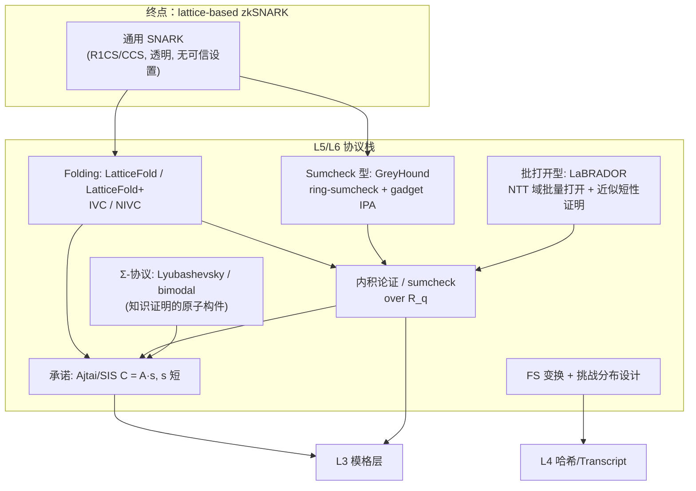
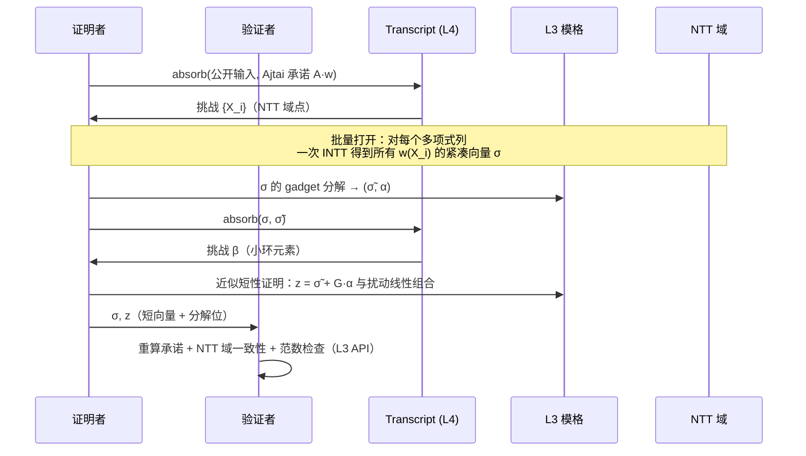

# Lattice ZK 与 zkSNARK 路线

ZK 这条线与 PQC 共享同一个基座（模格、NTT、范数、分解、FS），但多出**协议组件层 L5**：承诺、Σ-协议、内积论证 / sumcheck、折叠。本页给出组件栈、协议谱系与分阶段实施路线。

## 组件栈

## 安全性假设与参数

| 假设 | 陈述（非形式） | 用途 |
| --- | --- | --- |
| MSIS（模 SIS） | 给定 ` ∈ R_q^{k×l}`，找非零短 `z` 使 `·z = 0` 是难的 | 承诺的绑定性、Σ-协议可靠性 |
| SelfTargetMSIS | 在可预言哈希下找 `(z, c)` 使 `·z = H(c)` 是难的 | FS 化签名的 EUF-CMA（ML-DSA 同源） |
| LWE | 噪声线性方程组伪随机 | 某些承诺/加密型组件 |

挑战分布的选择（稀疏 ±1、小环 `R_p` 挑战、二模挑战）直接决定**提取出的见证范数膨胀因子（slack）**，进而决定 MSIS 参数——这是 ZK 路线的参数设计核心，实现阶段用 lattice-estimator 校准并固化到参数集页。

## 双环技巧（SNARK 友好参数的关键）

PQC 参数（如 `q = 8380417`）对 SNARK 并非最优。协议文献采用**两个环**配合：

- `R_q = Z_q[X]/(X^d + 1)`：小模数（常取 2 的幂，如 `q = 2^32`），归约极廉价、范数/分解语义干净，承载**见证与承诺**；
- `R_Q`（`q | Q` 或 `R_q ↪ R_Q`）：NTT 友好大模数，承载 **sumcheck / NTT 域运算**与挑战；
- 挑战从**小子环/小分布**抽取（如二进制系数），保证线性组合后的见证保持短。

本库的 L2/L3 设计（表示自由、`mod_switch`、NTT 域缓存）正是为这种"同类型、双参数"共存准备的：`PolyRing<Zq<Q>, D>` 与 `PolyRing<Zq<q>, D>` 是不同类型，转换走显式 `Embed`/`ModSwitch` trait。

## LaBRADOR 型协议（批打开型）怎么落在基座上

LaBRADOR（Beullens–Seiler, 2023）用 `R = Z_{2^32}[X]/(X^64+1)`（归约 = 移位）为 R1CS 生成几 KB 的透明证明。其三个关键动作与基座 API 的对应：

- **Ajtai 承诺** = `ModuleMatrix::mul_vec`（承诺矩阵在 NTT 域常驻）；
- **批打开** = NTT 域求值缓存（L1/L2 的 `NttDomain`）；
- **近似短性证明**（reveal 分解位而非隐藏小噪声）= L3 `decompose_gadget`；
- **范数检查** = L3 `is_bounded`。

## 分阶段路线（Z1–Z4）

| 阶段 | 交付物 | 验收标准 | 依赖 |
| --- | --- | --- | --- |
| **Z1** Σ-协议基元 | Ajtai 承诺 trait；Lyubashevsky 型近似知识证明（Module-SIS 版）；FS 化 NIZK；slack 分析文档 | 自绘 KAT + 提取器测试（能从两不同挑战的 transcript 提取短见证）；参数经 estimator 校准 | L3、L4 |
| **Z2** 批量打开 | LaBRADOR 风格 batched opening；近似短性证明库；`Z_{2^32}` 环实例 | 对 10^4 级约束的 toy R1CS 出 ≤ 10 KB 证明，验证者无需受信设置 | Z1 |
| **Z3** sumcheck 型 | ring-sumcheck over `R_q`（GreyHound 风格）；gadget-IPA；CCS/R1CS 算术化适配层 | 与 Z2 对拍同一实例；证明尺寸/证明时间基准发布 | Z1 |
| **Z4** 折叠与完整 SNARK | LatticeFold+/IVC；完整 zkSNARK（透明；ZK 化经盲化承诺）；约束系统前端（circuit DSL 最小版） | 端到端基准：10^6 约束级；IVC 循环正确性 property test | Z2+Z3 |

**ZK（零知识）说明**：Z1–Z2 的 Lyubashevsky/LaBRADOR 型协议先交付**知识证明**（非零知识、透明）；ZK 通过盲化（承诺中加掩码向量 + 相应近似证明）在 Z3/Z4 补齐——这是文献的标准顺序，也让我们尽早拿到可验证的组件。

**非算术约束**（位运算/查表）是格 SNARK 的公认弱项，路线采用**分解编码**（bit-decomposition via gadget）起步，查表方案作为研究性分支，不在 Z4 门槛内。

## 与 PQC 线的共享审计点

以下 L3/L4 API 同时被两条线依赖，其正确性测试必须共享：

1. 范数与中心化（`centered`、`infinity_norm`、`is_bounded`）——PQC 的签名验证与 ZK 的可靠性同源；
2. gadget 分解——ML-DSA 的 t1/hint 与 LaBRADOR/GreyHound 的近似证明；
3. NTT 域表示与 `mod_switch`——ML-DSA 的 Â 缓存与双环 SNARK；
4. Transcript 域分隔——ML-DSA 的 EUF-CMA 与 ZK 的 FS 可靠性。
