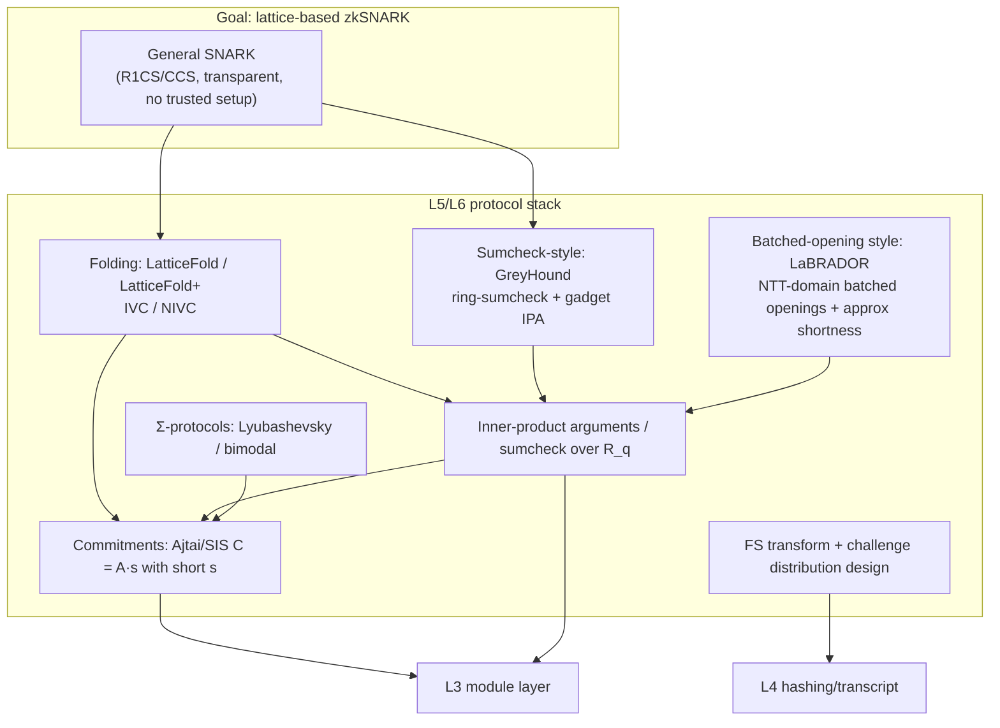
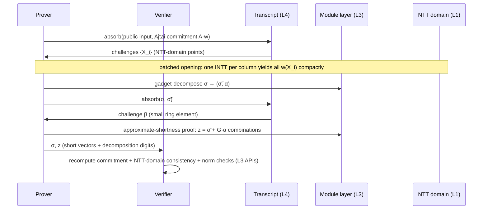

# Lattice ZK & zkSNARK Roadmap

The ZK line shares the same base (modules, NTT, norms, decomposition, Fiat–Shamir) and adds the **L5 protocol-component layer**: commitments, Σ-protocols, inner-product arguments / sumcheck, folding. This page records the component stack, the protocol lineage and the staged delivery plan.

## Component stack

## Assumptions and parameters

| Assumption | Statement (informal) | Used for |
| --- | --- | --- |
| MSIS (Module-SIS) | given ` ∈ R_q^{k×l}`, finding a non-zero short `z` with `·z = 0` is hard | commitment binding, Σ-protocol soundness |
| SelfTargetMSIS | finding `(z, c)` with `·z = H(c)` given the hash oracle is hard | FS-transformed signatures (same source as ML-DSA EUF-CMA) |
| LWE | noisy linear systems are pseudorandom | some commitment/encryption-flavored components |

The challenge distribution (sparse ±1, small-ring elements, binary) determines the **norm-inflation (slack) factor** of the extracted witness, which in turn fixes the MSIS parameters — this is the parameter-design core of the ZK line, calibrated with the lattice-estimator during implementation.

## The double-ring trick

PQC parameters (e.g. `q = 8380417`) are not SNARK-optimal. The literature pairs two rings:

- `R_q = Z_q[X]/(X^d+1)` with a small modulus (often `q = 2^32`): cheap reduction, clean norm/decomposition semantics, carries **witnesses and commitments**;
- `R_Q` with an NTT-friendly larger modulus (`q | Q`): carries **sumcheck / NTT-domain arithmetic** and challenges;
- challenges drawn from a small sub-ring/distribution keep linear combinations short.

The L2/L3 design (representation freedom, planned `Embed`/`ModSwitch` traits, NTT-domain caching) exists precisely so that `PolyRing<Zq<q>, D>` and `PolyRing<Zq<Q>, D>` can coexist with explicit conversions.

## How a LaBRADOR-style protocol maps to the base

LaBRADOR (Beullens–Seiler, 2023) proves R1CS knowledge over `R = Z_{2^32}[X]/(X^64+1)` with few-KB transparent proofs. Its three key moves map to base APIs:

- **Ajtai commitment** = `ModuleMatrix::mul_vec` (matrix resident in the NTT domain);
- **batched opening** = NTT-domain evaluation caches (`NttDomain`);
- **approximate shortness proofs** (revealing decomposition digits) = `module` gadget decomposition;
- **norm checks** = `CenteredRing` + module `is_bounded`.

## Staged delivery (Z1–Z4)

| Stage | Deliverable | Acceptance | Depends on |
| --- | --- | --- | --- |
| **Z1** Σ-protocol primitives ✅ | Ajtai commitment trait; Lyubashevsky-style approximate knowledge proof; FS-NIZK; slack analysis | extractor test (two challenges → relaxed witness `A·s_ext = v·t`, honest case `s_ext = v·s`, slack bounds met); HVZK via rejection; estimator calibration pending | L3 ✅, L4 ✅ |
| **Z2** batched openings ✅ | `Z_{2^32}` ring instance; batched opening + masked constraint consistency; gadget split with provable slack | 10^4-ring-constraint toy R1CS, ≈ 3 KB transparent proof; extractor + robustness tests | Z1 ✅ |
| **Z3** sumcheck-style ✅ | ring-sumcheck over `R_q` (GreyHound-style); gadget-IPA | cross-checked against Z2 on the same instance; size/time benchmarks published | Z2 ✅ |
| **Z4** folding & full SNARK | LatticeFold+/IVC; complete transparent zkSNARK (ZK via blinding commitments); minimal circuit DSL | end-to-end at 10^6-constraint scale; IVC correctness property tests | Z2+Z3 |

**Zero-knowledge note**: Z1–Z2 deliver *proofs of knowledge* (transparent, not ZK) first; ZK comes via blinding (masked commitments + matching approximate proofs) in Z3/Z4 — the literature's standard order, and the fastest path to verifiable components.

**Non-arithmetic constraints** (bit operations, lookups) are the acknowledged weak spot of lattice SNARKs; the plan starts with bit-decomposition via gadgets and treats lookup arguments as a research branch outside the Z4 gate.

## Shared audit points with the PQC line

These L3/L4 APIs are depended on by both lines; their tests must stay shared:

1. norms and centered representatives (`centered`, `abs_infinity`, `is_bounded`);
2. gadget decomposition (ML-DSA `t1`/hints ↔ LaBRADOR/GreyHound approximate proofs);
3. NTT-domain representation and modulus switching (ML-DSA `Â` caching ↔ double-ring SNARKs);
4. transcript domain separation (ML-DSA EUF-CMA ↔ ZK FS soundness).
